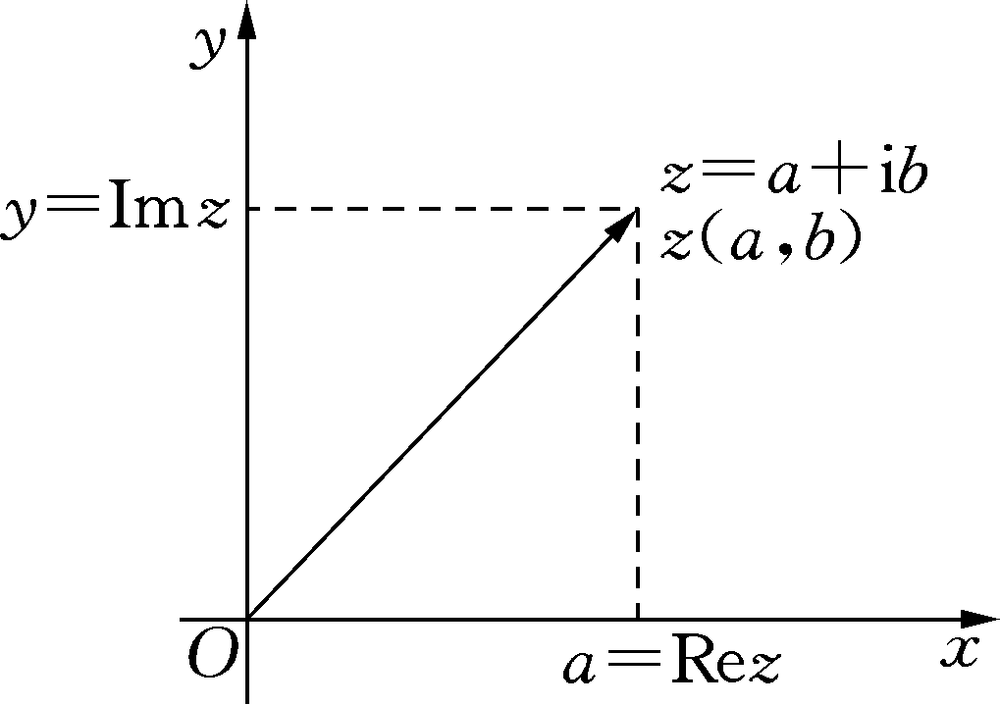
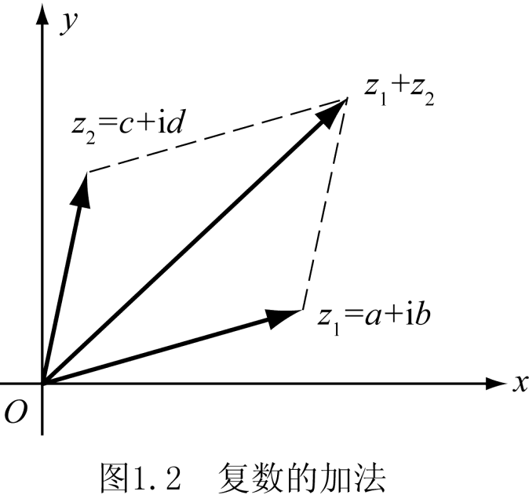
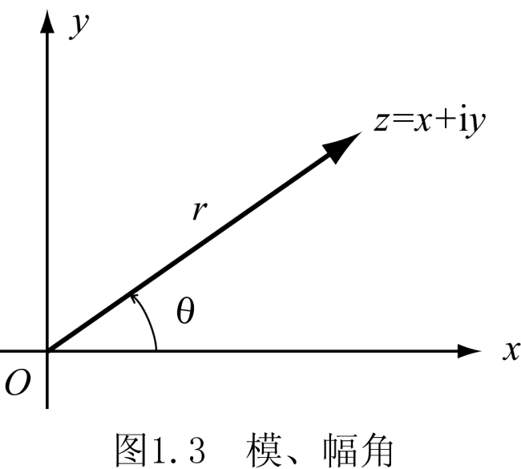
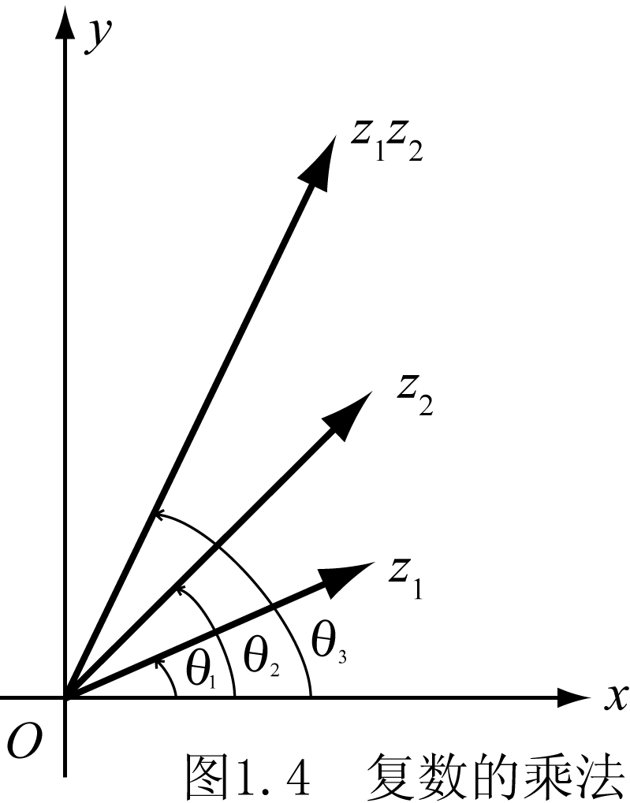
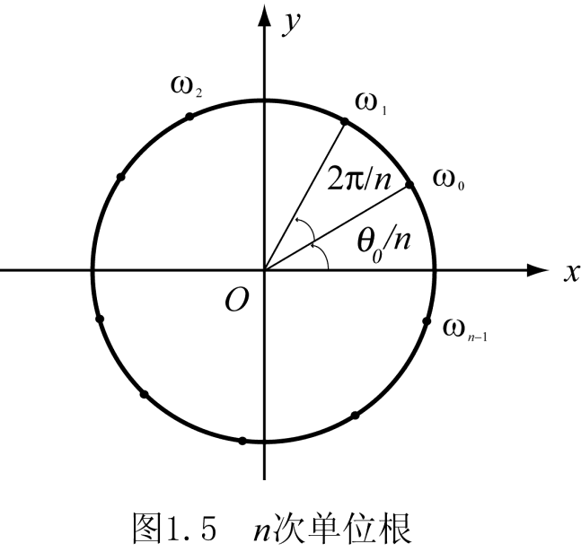

# 1.1 复数

> 本节目标：理解复数的代数形式、几何表示、模与辐角，能熟练进行复数的四则运算、乘方与开方，并掌握复数的三角形式、指数形式及其几何意义。
> 重点：模与辐角、乘除法的几何意义、n 次方根。
> 难点：辐角的多值性、主值 arg z 的确定。

## 1.1.1 复数的概念

**定义 1.1** 形如

$$
z = a + ib,\qquad a,b \in \mathbb{R}
$$

的数称为复数，其中 $i$ 称为**虚单位**，满足

$$
i^2 = -1 .
$$

$a$ 与 $b$ 分别称为复数 $z$ 的实部和虚部，记作

$$
a = \operatorname{Re} z,\qquad b = \operatorname{Im} z .
$$

- 当且仅当 $b=0$ 时，$z=a$ 是实数；
- 当且仅当 $a=b=0$ 时，$z$ 就是实数 $0$；
- 当 $b\neq 0$ 时，$z$ 称为**虚数**；
- 当 $a=0$ 且 $b\neq 0$ 时，$z=ib$ 称为**纯虚数**。

全体复数组成的集合称为**复数集**，记作 $\mathbb{C}$；实数集 $\mathbb{R}$ 是 $\mathbb{C}$ 的真子集。

两个复数 $z_1=a+ib$ 与 $z_2=c+id$ 相等，当且仅当它们的实部和虚部分别相等：

$$
z_1 = z_2 \iff a=c \ \text{且}\ b=d .
$$

## 1.1.2 复数的几何表示与复平面

复数 $z=a+ib$ 可用平面上的点 $z(a,b)$ 表示。用直角坐标系表示复数的平面称为**复平面**，$x$ 轴称为**实轴**，$y$ 轴称为**虚轴**。

- 实轴上的点表示实数；
- 除原点外，虚轴上的点表示纯虚数；
- 当两个复数的实部相等、虚部互为相反数时，称它们互为**共轭复数**：

$$
\bar z = a - ib .
$$

任一实数的共轭复数仍是它本身。

## 1.1.3 复数的模

在复平面上，复数 $z=a+ib$ 还可用由原点 $O$ 引向点 $z$ 的向量 $\overrightarrow{Oz}$ 表示。该向量的长度称为复数 $z$ 的**模**，记作 $|z|$（或 $r$）：

$$
|z| = r = \sqrt{a^2+b^2} \ge 0 .
$$

模与实部、虚部满足

$$
|\operatorname{Re} z| \le |z| \le |\operatorname{Re} z| + |\operatorname{Im} z|,
\qquad
|\operatorname{Im} z| \le |z| \le |\operatorname{Re} z| + |\operatorname{Im} z| .
$$

## 1.1.4 复数的四则运算

设 $z_1=a+ib$，$z_2=c+id$。

**加法**

$$
z_1+z_2 = (a+c)+i(b+d).
$$

**减法**

$$
z_1-z_2 = (a-c)+i(b-d).
$$

**乘法**

$$
z_1 z_2 = (a+ib)(c+id) = (ac-bd)+i(ad+bc),
\qquad
z^2 = z\cdot z .
$$

**除法**

$$
\frac{z_1}{z_2}
= \frac{a+ib}{c+id}
= \frac{(a+ib)(c-id)}{(c+id)(c-id)}
= \frac{ac+bd}{c^2+d^2} + i\,\frac{bc-ad}{c^2+d^2},\qquad z_2\neq 0 .
$$

## 1.1.5 模与共轭复数的性质

设 $z,w \in \mathbb{C}$，$w\neq 0$，则

$$
\begin{aligned}
&(1)\ \operatorname{Re} z = \frac{z+\bar z}{2},\qquad
\operatorname{Im} z = \frac{z-\bar z}{2i};\\[2pt]
&(2)\ \overline{z\pm w} = \bar z \pm \bar w,\qquad
\overline{zw} = \bar z\,\bar w,\qquad
\overline{\left(\frac{z}{w}\right)} = \frac{\bar z}{\bar w};\\[2pt]
&(3)\ z\bar z = |z|^2,\qquad
(4)\ \overline{\bar z} = z,\qquad
(5)\ z+\bar z = 2\operatorname{Re} z,\quad z-\bar z = 2i\operatorname{Im} z .
\end{aligned}
$$

## 1.1.6 复数的三角表示与指数形式

设复平面 $\mathbb{C}$ 上不为零的点 $z=x+iy$，取极坐标

$$
x = r\cos\theta,\qquad y = r\sin\theta,\qquad r=|z| .
$$

$\theta$ 是正实轴与从原点 $O$ 到 $z$ 的射线的夹角，称为复数 $z$ 的**辐角**，记作 $\theta=\operatorname{Arg}z$。满足

$$
-\pi < \theta \le \pi
$$

的辐角称为 $\operatorname{Arg}z$ 的**主值**，记作 $\theta=\arg z$，于是

$$
\operatorname{Arg} z = \arg z + 2k\pi,\quad k=0,\pm1,\pm2,\ldots .
$$

复数 $z$ 有**三角表示**与**指数表示**：

$$
z = r(\cos\theta+i\sin\theta)
\qquad\text{与}\qquad
z = re^{i\theta}.
$$

**例 1.1** 求 $\operatorname{Arg}(-3-4i)$。

**解** $(-3,-4)$ 位于第三象限，

$$
\arg(-3-4i) = \arctan\frac{4}{3}-\pi,
$$

所以

$$
\operatorname{Arg}(-3-4i)
= \arg(-3-4i)+2k\pi
= \arctan\frac{4}{3} + (2k-1)\pi,
\qquad k=0,\pm1,\pm2,\ldots .
$$

**例 1.2** 计算 $z=e^{i\pi}$。

**解**

$$
e^{i\pi} = \cos\pi + i\sin\pi = -1 .
$$

**例 1.3** 把 $\sqrt3+i$ 表示成三角形式和指数形式。

**解** $r=|\sqrt3+i|=\sqrt{3+1}=2$，$\cos\theta=\sqrt3/2$，点在第一象限，故 $\theta=\arg(\sqrt3+i)=\pi/6$，从而

$$
\sqrt3+i = 2\left(\cos\frac{\pi}{6}+i\sin\frac{\pi}{6}\right) = 2e^{i\pi/6}.
$$

## 1.1.7 复数乘除法的几何意义

设

$$
z_1 = r_1(\cos\theta_1+i\sin\theta_1),\qquad
z_2 = r_2(\cos\theta_2+i\sin\theta_2),
$$

利用三角恒等式可得

$$
\begin{aligned}
z_1z_2
&= r_1r_2\bigl[(\cos\theta_1\cos\theta_2-\sin\theta_1\sin\theta_2)
+i(\sin\theta_1\cos\theta_2+\cos\theta_1\sin\theta_2)\bigr]\\[2pt]
&= r_1r_2\bigl[\cos(\theta_1+\theta_2)+i\sin(\theta_1+\theta_2)\bigr],
\end{aligned}
$$

即

$$
|z_1z_2| = r_1r_2 = |z_1|\,|z_2|,
\qquad
\operatorname{Arg}(z_1z_2) = \operatorname{Arg}z_1+\operatorname{Arg}z_2 .
$$

**两个复数相乘：积的模等于各复数模的积，积的辐角等于两复数辐角的和。**

类似地，

$$
\left|\frac{z_1}{z_2}\right| = \frac{|z_1|}{|z_2|},
\qquad
\operatorname{Arg}\frac{z_1}{z_2} = \operatorname{Arg}z_1 - \operatorname{Arg}z_2 .
$$

## 1.1.8 复数的乘方与开方

**乘方** 设 $z=re^{i\theta}$，则

$$
z^n = \left(re^{i\theta}\right)^n = r^n e^{in\theta}
= r^n(\cos n\theta+i\sin n\theta),
\qquad
|z^n| = |z|^n .
$$

当 $r=1$ 时，得到 **棣莫弗（de Moivre）公式**：

$$
(\cos\theta+i\sin\theta)^n = \cos n\theta + i\sin n\theta .
$$

**开方** 设 $z=re^{i\theta}$ 是已知复数，$n$ 为正整数，满足方程

$$
\omega^n = z
$$

的全体复数 $\omega$ 称为 $z$ 的 **$n$ 次方根**，记作 $\omega=\sqrt[n]{z}$。

设 $\omega=\rho e^{i\varphi}$，由 $\rho^n e^{in\varphi}=re^{i\theta}$ 得

$$
\rho = \sqrt[n]{r},\qquad
\varphi = \frac{\theta+2k\pi}{n},\quad k=0,1,\ldots,n-1,
$$

所以

$$
\sqrt[n]{z} = \omega_k
= \sqrt[n]{r}\,e^{i\frac{\theta+2k\pi}{n}},
\qquad k=0,1,2,\ldots,n-1 .
$$

复数的 $n$ 次方根共有 $n$ 个：它们的模都等于该复数模的 $n$ 次算术根，辐角分别等于该复数辐角与 $0,1,\ldots,n-1$ 倍 $2\pi$ 之和的 $n$ 分之一。

**例 1.4** 求 $1-i$ 的立方根。

**解** 先写指数形式：

$$
1-i = \sqrt2\,e^{i7\pi/4},
$$

则

$$
\sqrt[3]{1-i}
= 2^{1/6}e^{i\frac{7\pi/4+2k\pi}{3}}
= 2^{1/6}e^{i\left(\frac{7\pi}{12}+\frac{2k\pi}{3}\right)},
\qquad k=0,1,2 .
$$

即三个立方根为

$$
2^{1/6}e^{i7\pi/12},\qquad
2^{1/6}e^{i5\pi/4},\qquad
2^{1/6}e^{i23\pi/12}.
$$

**例 1.5** 计算 $n$ 次单位根。

**解** $1=e^{i0}$，故 $n$ 次单位根为

$$
1,\quad e^{i\frac{2\pi}{n}},\quad e^{i\frac{4\pi}{n}},\quad \ldots,\quad
e^{i\frac{2(n-1)\pi}{n}} .
$$

立方单位根为

$$
1,\qquad \frac{-1+i\sqrt3}{2},\qquad \frac{-1-i\sqrt3}{2}.
$$

## 常见错误与注意点

1. **辐角是多值的**：$\operatorname{Arg}z$ 与 $\arg z$ 不可混用；写 $\operatorname{Arg}z$ 时务必补 $2k\pi$。
2. **开方记号的约定**：$\sqrt[n]{z}$ 表示 $n$ 个值；实数范围内“根号”的单值约定在复数范围内不再成立。
3. **分母不为零**：作除法 $z_1/z_2$ 时，必须先说明 $z_2\neq 0$。
4. **点 $(a,b)$ vs 向量 $\overrightarrow{Oz}$**：复平面中同一个复数既可看作点，也可看作向量，两者都常用。

## 本节小结

- 复数 $z=a+ib$：实部/虚部、共轭、模、辐角；
- 运算：加减乘除、乘方、开方；
- 几何意义：乘 = 模相乘 + 辐角相加；除 = 模相除 + 辐角相减；
- 工具：三角形式 $z=r(\cos\theta+i\sin\theta)$ 与指数形式 $z=re^{i\theta}$。
