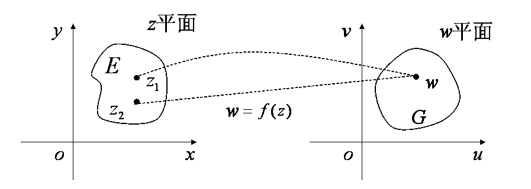
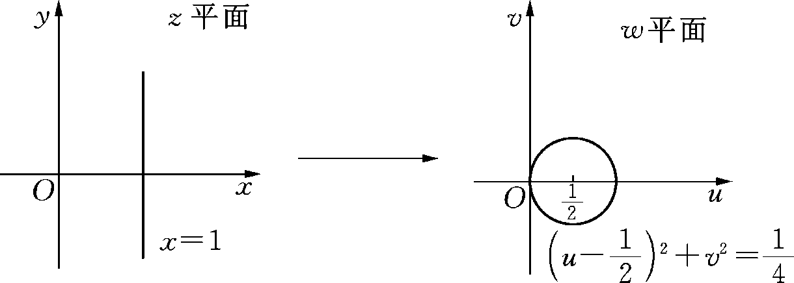
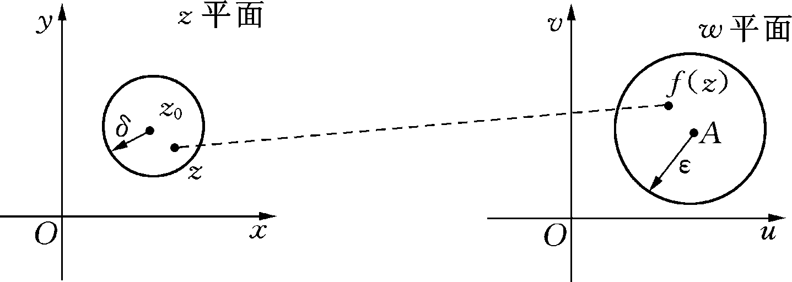

# §2.1 复变函数的概念、极限与连续性

> **本节目标**：掌握复变函数的概念、几何意义（映射）、反函数；理解复变函数极限的 $\varepsilon$-$\delta$ 定义及其与二元实函数极限的联系；掌握复变函数连续的概念与判定。
> **本节重点**：复变函数作为两个复平面上点集间的映射；极限与连续的概念；用实部/虚部函数研究极限与连续性。
> **本节难点**：极限存在的充要条件（与二元实函数极限的等价性）；$\arg z$ 的连续性（负实轴上的间断）。

## 2.1.1 复变函数的概念

**定义 2.1** 设 $E$ 为一复数集。若对 $E$ 中每一个复数 $z=x+iy$，按照某种法则 $f$ 有确定的一个或几个复数 $w=u+iv$ 与之对应，那么称复变数 $w$ 是复变数 $z$ 的函数（简称**复变函数**），记作

$$
w=f(z).
$$

通常也称 $w=f(z)$ 为定义在 $E$ 上的复变函数，其中 $E$ 称为**定义域**，$E$ 中所有 $z$ 对应的一切 $w$ 值构成的集合称为 $f(z)$ 的**值域**，记作 $f(E)$ 或 $G$。

- 若 $z$ 的一个值对应着 $w$ 的一个值，则称复变函数 $f(z)$ 是**单值**的；
- 若 $z$ 的一个值对应着 $w$ 的两个或两个以上的值，则称复变函数 $f(z)$ 是**多值**的。

### 实部与虚部

复数 $z=x+iy$ 与 $w=u+iv$ 分别对应实数对 $(x,y)$ 和 $(u,v)$。对于函数 $w=f(z)$，$u$、$v$ 为 $x$、$y$ 的二元实函数 $u(x,y)$ 和 $v(x,y)$，所以 $w=f(z)$ 又常写成

$$
w=f(z)=u(x,y)+iv(x,y).
$$

**例（$w=z^2+1$）** 令 $z=x+iy$，$w=u+iv$，那么

$$
w=u+iv=(x+iy)^2+1=x^2-y^2+1+2xyi,
$$

$w=z^2+1$ 对应于两个实函数

$$
u=x^2-y^2+1,\qquad v=2xy.
$$

### 复变函数的映射（几何）意义

对于复变函数 $w=f(z)$ 即 $u+iv=f(x+iy)$，可以理解为两个复平面上的点集之间的映射。具体地说，复变函数 $w=f(z)$ 给出了 $z$ 平面上的点集 $E$ 到 $w$ 平面上的点集 $f(E)$（或 $G$）之间的一个对应关系：

$$
\forall z\in E \rightarrow w=f(z)\in G .
$$

其中 $w$ 称为 $z$ 的**像**，$z$ 称为 $w$ 的**原像**。

### 反函数

设函数 $w=f(z)$ 定义在 $E$ 上，值域为 $G$。若对于 $G$ 中的任一点 $w$，在 $E$ 中存在一个或几个点 $z$ 与之对应，则在 $G$ 上确定了一个单值或多值函数，记作 $z=f^{-1}(w)$，称为函数 $w=f(z)$ 的**反函数**。

**例 2.1** 函数 $\displaystyle w=\frac{1}{z}$ 将 $z$ 平面上的直线 $x=1$ 变成 $w$ 平面上的何种曲线？

**解** 令 $z=x+iy$，$w=u+iv$，则

$$
w=u+iv=\frac{1}{z}=\frac{1}{x+iy}=\frac{x-iy}{x^2+y^2},
$$

故

$$
u=\frac{x}{x^2+y^2},\qquad v=-\frac{y}{x^2+y^2}.
$$

$z$ 平面上的直线 $x=1$ 对应于 $w$ 平面上的曲线

$$
u=\frac{1}{1+y^2},\qquad v=-\frac{y}{1+y^2}.
$$

于是

$$
u^2+v^2
=\frac{1}{(1+y^2)^2}+\frac{y^2}{(1+y^2)^2}
=\frac{1}{1+y^2}=u,
$$

即

$$
\left(u-\frac{1}{2}\right)^2+v^2=\frac{1}{4}.
$$

所以直线 $x=1$ 被映射为 $w$ 平面上以 $\left(\dfrac{1}{2},0\right)$ 为圆心、$\dfrac{1}{2}$ 为半径的圆。

## 2.1.2 复变函数的极限

**定义 2.2** 设函数 $w=f(z)$ 定义在 $z_0$ 的去心邻域 $0<|z-z_0|<r$ 内。若存在常数 $A$，对于任意给定的 $\varepsilon>0$，都存在一正数 $\delta$（$0<\delta\le r$），使得当 $0<|z-z_0|<\delta$ 时，有

$$
|f(z)-A|<\varepsilon,
$$

则称函数 $f(z)$ 当 $z\to z_0$ 时的极限存在，常数 $A$ 为其极限值，记作

$$
\lim_{z\to z_0}f(z)=A
\qquad\text{或}\qquad
f(z)\to A\ (z\to z_0).
$$

**几何意义** 当变点 $z$ 进入 $z_0$ 的充分小的去心邻域时，它的像点 $f(z)$ 就落入 $A$ 的一个预先给定的邻域内。

> 定义中 $z\to z_0$ 的方式是任意的：$z$ 在 $z_0$ 的去心邻域内沿任何曲线以任何方式趋于 $z_0$ 时，$f(z)$ 都要趋向于同一个常数 $A$。

**定理 2.1** 设 $f(z)=u(x,y)+iv(x,y)$，$z_0=x_0+iy_0$，$A=a+ib$，则

$$
\lim_{z\to z_0}f(z)=A
\iff
\lim_{(x,y)\to(x_0,y_0)}u(x,y)=a,\quad
\lim_{(x,y)\to(x_0,y_0)}v(x,y)=b .
$$

**证明要点**

- **必要性**：设 $\lim_{z\to z_0}f(z)=A$，即对任意 $\varepsilon>0$，存在 $\delta>0$，当

$$
0<|z-z_0|=\sqrt{(x-x_0)^2+(y-y_0)^2}<\delta
$$

时，有

$$
|f(z)-A|=\sqrt{(u-a)^2+(v-b)^2}<\varepsilon .
$$

由于 $|u-a|\le\sqrt{(u-a)^2+(v-b)^2}$，$|v-b|\le\sqrt{(u-a)^2+(v-b)^2}$，故 $|u-a|<\varepsilon$、$|v-b|<\varepsilon$，从而两个实函数极限成立。

- **充分性**：设两个实函数极限成立，则当 $\sqrt{(x-x_0)^2+(y-y_0)^2}<\delta$ 时，有 $|u-a|<\frac{\varepsilon}{2}$，$|v-b|<\frac{\varepsilon}{2}$，所以

$$
|f(z)-A|=|(u-a)+i(v-b)|\le|u-a|+|v-b|<\varepsilon ,
$$

即 $\lim_{z\to z_0}f(z)=A$。

**定理 2.2（极限运算法则）** 若

$$
\lim_{z\to z_0}f(z)=A,\qquad \lim_{z\to z_0}g(z)=B,
$$

则

$$
(1)\ \lim_{z\to z_0}\bigl(f(z)\pm g(z)\bigr)=A\pm B;\qquad
(2)\ \lim_{z\to z_0}f(z)\cdot g(z)=AB;
$$

$$
(3)\ \lim_{z\to z_0}\frac{f(z)}{g(z)}=\frac{A}{B}\quad (B\neq 0).
$$

**例 2.2** 判断下列函数在原点处的极限是否存在，若存在，试求出极限值：

$$
(1)\ f(z)=\frac{z\operatorname{Re}(z)}{|z|};\qquad
(2)\ f(z)=\frac{\operatorname{Re}(z^2)}{|z|^2}.
$$

**解**

**(1) 方法一** 因为

$$
|f(z)|=\left|z\frac{\operatorname{Re}(z)}{z}\right|\le |z|,
$$

所以对任意 $\varepsilon>0$，取 $\delta=\varepsilon$，当 $0<|z|<\delta$ 时，总有

$$
|f(z)-0|=|f(z)|\le|z|<\varepsilon .
$$

根据极限定义，$\lim_{z\to0}f(z)=0$。

**(1) 方法二** 设 $z=x+iy$，则

$$
f(z)=\frac{(x+iy)x}{\sqrt{x^2+y^2}}
=\frac{x^2}{\sqrt{x^2+y^2}}+i\frac{xy}{\sqrt{x^2+y^2}},
$$

故

$$
u(x,y)=\frac{x^2}{\sqrt{x^2+y^2}},\qquad
v(x,y)=\frac{xy}{\sqrt{x^2+y^2}},
$$

且

$$
\lim_{(x,y)\to(0,0)}u=0,\qquad \lim_{(x,y)\to(0,0)}v=0 .
$$

由定理 2.1，得 $\lim_{z\to0}f(z)=0$。

**(2) 方法一** 设 $z=x+iy$，则

$$
z^2=x^2-y^2+2xyi,\qquad |z|^2=x^2+y^2,
$$

故

$$
f(z)=\frac{\operatorname{Re}(z^2)}{|z|^2}=\frac{x^2-y^2}{x^2+y^2},\qquad
u(x,y)=\frac{x^2-y^2}{x^2+y^2},\quad v(x,y)=0 .
$$

让 $z$ 沿直线 $y=kx$ 趋向于 $0$，有

$$
\lim_{(x,y)\to(0,0)}u(x,y)=\lim_{x\to0}\frac{x^2-k^2x^2}{x^2+k^2x^2}
=\frac{1-k^2}{1+k^2}.
$$

极限随 $k$ 变化而不同，所以 $\lim_{z\to0}f(z)$ 不存在。

**(2) 方法二** 设 $z=re^{i\theta}$，则

$$
f(z)=\frac{r^2\cos 2\theta}{r^2}=\cos 2\theta .
$$

让 $z$ 沿不同射线 $\arg z=\theta$ 趋向于 $0$ 时，$f(z)$ 趋向于不同的值，所以极限不存在。

## 2.1.3 复变函数的连续性

**定义 2.3** 若

$$
\lim_{z\to z_0}f(z)=f(z_0),
$$

则说函数 $f(z)$ 在点 $z_0$ 处连续。如果函数 $f(z)$ 在区域 $D$ 内每一点都连续，那么称函数 $f(z)$ 在区域 $D$ 内连续。

**定理 2.3** 若 $f(z)$、$g(z)$ 在点 $z_0$ 连续，则其和、差、积、商（要求分母不为零）在点 $z_0$ 处连续。特别地：

- (1) 多项式 $\displaystyle w=a_0z^n+a_1z^{n-1}+\cdots+a_{n-1}z+a_n$ 在整个复平面上连续；
- (2) 任何一个有理分式函数 $\displaystyle w=\frac{a_0z^n+a_1z^{n-1}+\cdots+a_{n-1}z+a_n}{b_0z^m+b_1z^{m-1}+\cdots+b_{m-1}z+b_m}$ 在复平面上除去使分母为零的点外处处连续。

**定理 2.4** 若函数 $h=g(z)$ 在点 $z_0$ 连续，函数 $\varphi=f(h)$ 在 $h_0=g(z_0)$ 连续，则复合函数 $\varphi=f(g(z))$ 在 $z_0$ 处连续。

**定理 2.5** 设函数

$$
f(z)=u(x,y)+iv(x,y),\qquad z_0=x_0+iy_0,
$$

则 $f(z)$ 在点 $z_0$ 连续的充分必要条件是 $u(x,y)$、$v(x,y)$ 均在点 $(x_0,y_0)$ 处连续。

**例 2.3** 讨论函数 $\arg z$ 的连续性。

**解**

- 当 $z=0$ 时，$\arg z$ 无定义，因而不连续。
- 当 $z_0$ 为负实轴上的点，即 $z_0=x_0<0$ 时：

$$
\lim_{y\to0^-,\,z\to z_0}\arg z=\lim_{y\to0^-,\,x\to x_0}\left(\arctan\frac{y}{x}-\pi\right)=-\pi,
$$

$$
\lim_{y\to0^+,\,z\to z_0}\arg z=\lim_{y\to0^+,\,x\to x_0}\left(\arctan\frac{y}{x}+\pi\right)=\pi,
$$

左右极限不等，故 $\arg z$ 在负实轴上不连续。

- 若 $z_0=x_0+iy_0$ 不是原点也不是负实轴及虚轴上的点，设 $x_0\neq 0$，则

$$
\arg z=
\begin{cases}
\arctan(y/x),\\
\arctan(y/x)\pm\pi,
\end{cases}
$$

且

$$
\lim_{z\to z_0}\arg z
=\lim_{(x,y)\to(x_0,y_0)}
\begin{cases}
\arctan(y/x),\\
\arctan(y/x)\pm\pi
\end{cases}
=
\begin{cases}
\arctan(y_0/x_0),\\
\arctan(y_0/x_0)\pm\pi
\end{cases}
=\arg z_0 .
$$

故 $\lim_{z\to z_0}\arg z=\arg z_0$，即 $\arg z$ 在除去原点和负实轴及虚轴的复平面上连续。

- 当 $z_0$ 为正、负虚轴上的点 $z_0=iy_0$（$y_0\neq 0$）时，

$$
\lim_{z\to z_0}\arg z=\pm\frac{\pi}{2}=\arg z_0,
$$

故 $\arg z$ 在虚轴上也连续。

因此 $\arg z$ 在复平面上除了原点和负实轴外连续。

**补充（连续函数的有界性）** 设 $\overline D$ 为复平面上的有界闭区域，函数 $w=f(z)$ 在 $\overline D$ 上连续，则函数 $f(z)$ 在 $\overline D$ 上有界，即存在常数 $M$，使对于 $\forall z\in\overline D$，都有 $|f(z)|\le M$。在闭曲线或包含曲线端点在内的曲线段上连续的函数 $f(z)$ 在曲线上有界，即 $|f(z)|\le M$。

## 常见错误与注意点

1. **极限定义中 $z\to z_0$ 具有任意性**：$z$ 沿任何路径趋于 $z_0$ 都必须趋向同一常数 $A$。仅沿个别路径（如直线）极限存在不能说明极限存在；反之，沿两条路径得到不同值则极限一定不存在。
2. **$\operatorname{Re}(z)$、$\operatorname{Im}(z)$、$\bar z$、$|z|$ 常常不是“好”函数**：判断其极限、可导性时，常需借助实部/虚部或两条路径验证。
3. **$\arg z$ 的连续性**：$\arg z$ 在原点无定义，在负实轴处左右极限不等，故负实轴是间断线；实轴、虚轴其余点连续。
4. **复变函数的极限**：先化为 $u(x,y)$、$v(x,y)$ 两个二元实函数极限，再借助定理 2.1 判断，往往更简便。

## 本节小结

- 复变函数 $w=f(z)=u(x,y)+iv(x,y)$：定义域 $E$、值域 $f(E)=G$、映射、像与原像、单值/多值、反函数。
- 复变函数的极限：$\varepsilon$-$\delta$ 定义；$\lim_{z\to z_0}f(z)=A \iff$ 实部、虚部同时收敛。
- 极限运算法则：和差积商。
- 连续性：逐点连续、区域连续；和差积商连续；复合连续；$u,v$ 同时连续 $\iff f$ 连续。
- 典型结论：$\arg z$ 在除去原点和负实轴外连续；连续函数在有界闭区域上有界。
