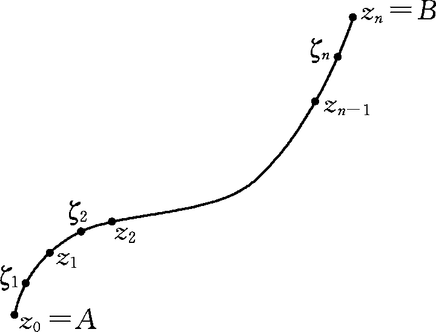
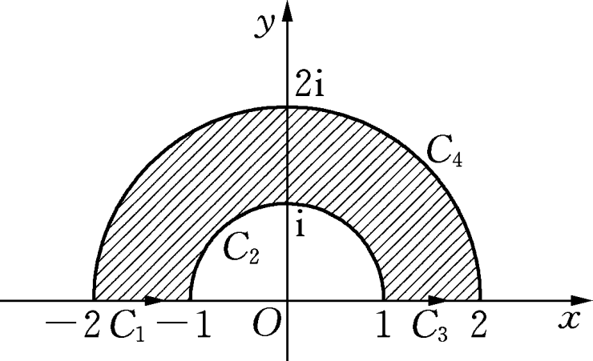
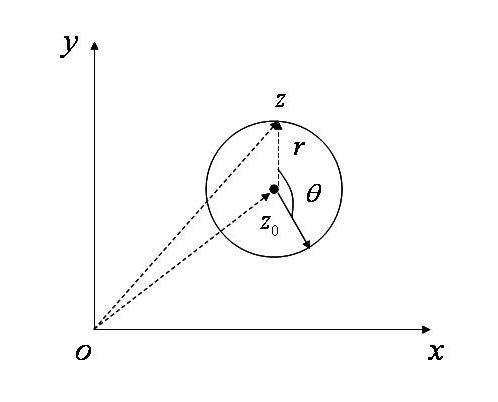

# 3.1 复变函数积分的概念

> 本节目标：理解有向曲线的正向与负向约定，掌握复变函数积分的定义与四个基本性质，会用参数方程法（以及化归为两个实第二类曲线积分）计算复变函数积分。
> 重点：复变函数积分的定义、性质 3.1–3.4、定理 3.1 与参数方程法、典型积分 $\int_C z^2dz$、$\int_C\operatorname{Im}(z)dz$、$\oint_C d z/(z-z_0)^{n+1}$。
> 难点：积分的存在性定义（极限与分法、取点无关）；积分不等式 $ML$ 估计；非解析函数积分与路径有关。

## 3.1.1 有向曲线与复变函数积分的定义

设平面上光滑或分段光滑曲线 $C$ 的两个端点为 $A$ 和 $B$。$C$ 可能有两个方向：从点 $A$ 到点 $B$ 和从点 $B$ 到点 $A$。若规定其中一个方向（例如从点 $A$ 到点 $B$ 的方向）为正方向，则称 $C$ 为**有向曲线**。此时称点 $A$ 为曲线 $C$ 的**起点**，点 $B$ 为曲线 $C$ 的**终点**。若正方向指从起点到终点的方向，那么从终点 $B$ 到起点 $A$ 的方向则称为曲线 $C$ 的**负方向**，记作 $C^-$。

**定义 3.1** 设 $C$ 为一条光滑或分段光滑的有向曲线，其中 $A$ 为起点，$B$ 为终点，函数 $f(z)$ 在曲线 $C$ 上有定义。现沿着 $C$ 按从点 $A$ 到点 $B$ 的方向，在 $C$ 上依次任取分点

$$
A=z_0,z_1,\dots,z_{n-1},z_n=B,
$$

将曲线 $C$ 划分成 $n$ 个小弧段 $z_{k-1}z_k$。在每个小弧段 $z_{k-1}z_k$（$k=1,2,\dots,n$）上任取一点 $\zeta_k$，并作和式

$$
S_n=\sum_{k=1}^{n}f(\zeta_k)\Delta z_k,\qquad \Delta z_k=z_k-z_{k-1}.
$$

记 $\lambda$ 为 $n$ 个小弧段长度中的最大值。当 $\lambda$ 趋向于零时，若不论对曲线 $C$ 的分法及点 $\zeta_k$ 的取法如何，$S_n$ 的极限存在，则称函数 $f(z)$ 沿曲线 $C$ **可积**，并称这个极限值为函数 $f(z)$ 沿曲线 $C$ 的积分，记作

$$
\int_C f(z)\,dz=\lim_{\lambda\to 0}\sum_{k=1}^{n}f(\zeta_k)\Delta z_k .
$$

$f(z)$ 称为**被积函数**，$f(z)\,dz$ 称为**被积表达式**。

## 3.1.2 闭曲线上的积分与正方向

若 $C$ 为闭曲线，$C$ 的正方向指的是：当点沿着曲线 $C$ 按所选定取积分的方向运动时，$C$ 所围区域始终在它的左侧。这时函数 $f(z)$ 沿曲线 $C$ 的积分记作

$$
\oint_C f(z)\,dz .
$$

## 3.1.3 复变函数积分的性质

**性质 3.1（方向性）** 若函数 $f(z)$ 沿曲线 $C$ 可积，则

$$
\int_C f(z)\,dz=-\int_{C^-} f(z)\,dz .
$$

**性质 3.2（线性性）** 若函数 $f(z)$ 和 $g(z)$ 沿曲线 $C$ 可积，则

$$
\int_C\big[\alpha f(z)+\beta g(z)\big]\,dz
=\alpha\int_C f(z)\,dz+\beta\int_C g(z)\,dz,
$$

其中 $\alpha,\beta$ 为任意常数。

**性质 3.3（对积分路径的可加性）** 若函数 $f(z)$ 沿曲线 $C$ 可积，曲线 $C$ 由曲线段 $C_1,C_2,\dots,C_n$ 依次首尾相接而成，则

$$
\int_C f(z)\,dz=\int_{C_1}f(z)\,dz+\int_{C_2}f(z)\,dz+\cdots+\int_{C_n}f(z)\,dz .
$$

**性质 3.4（积分不等式）** 若函数 $f(z)$ 沿曲线 $C$ 可积，且对 $\forall z\in C$ 满足 $|f(z)|\le M$，曲线 $C$ 的长度为 $L$，则

$$
\left|\int_C f(z)\,dz\right|\le\int_C |f(z)|\,ds\le ML,
$$

其中 $ds=|dz|=\sqrt{dx^2+dy^2}$ 为曲线 $C$ 的**弧微分**。

**证明要点** 记 $\Delta s_k$ 为 $z_{k-1}$ 与 $z_k$ 之间的弧长，则

$$
\left|\sum_{k=1}^{n}f(\zeta_k)\Delta z_k\right|
\le\sum_{k=1}^{n}|f(\zeta_k)|\,|\Delta z_k|
\le\sum_{k=1}^{n}|f(\zeta_k)|\,\Delta s_k .
$$

令 $\lambda\to 0$，两端取极限得

$$
\left|\int_C f(z)\,dz\right|\le\int_C |f(z)|\,ds .
$$

又

$$
\sum_{k=1}^{n}|f(\zeta_k)|\,\Delta s_k\le M\sum_{k=1}^{n}\Delta s_k=ML,
$$

故

$$
\left|\int_C f(z)\,dz\right|\le\int_C |f(z)|\,ds\le ML .
$$

## 3.1.4 复变函数积分的基本计算方法

**定理 3.1** 若函数 $f(z)=u(x,y)+iv(x,y)$ 沿曲线 $C$ 连续，则 $f(z)$ 沿 $C$ 可积，且

$$
\int_C f(z)\,dz=\int_C u\,dx-v\,dy+i\int_C v\,dx+u\,dy .
$$

**证明要点** 记 $z_k=x_k+iy_k$，$\zeta_k=\xi_k+i\eta_k$，则

$$
\Delta x_k=x_k-x_{k-1},\qquad \Delta y_k=y_k-y_{k-1},\qquad \Delta z_k=\Delta x_k+i\Delta y_k .
$$

于是

$$
\begin{aligned}
\sum_{k=1}^{n}f(\zeta_k)\Delta z_k
&=\sum_{k=1}^{n}\bigl(u(\xi_k,\eta_k)+iv(\xi_k,\eta_k)\bigr)(\Delta x_k+i\Delta y_k)\\
&=\sum_{k=1}^{n}\bigl[u(\xi_k,\eta_k)\Delta x_k-v(\xi_k,\eta_k)\Delta y_k\bigr]
+i\sum_{k=1}^{n}\bigl[v(\xi_k,\eta_k)\Delta x_k+u(\xi_k,\eta_k)\Delta y_k\bigr].
\end{aligned}
$$

已知 $f(z)$ 沿 $C$ 连续，所以必有 $u,v$ 都沿 $C$ 连续，于是这两个第二类曲线积分都存在，因此积分存在，且

$$
\int_C f(z)\,dz=\int_C u\,dx-v\,dy+i\int_C v\,dx+u\,dy .
$$

**参数方程法** 设 $C$ 为一光滑或分段光滑曲线，其参数方程为

$$
z=z(t)=x(t)+iy(t)\quad(a\le t\le b),
$$

参数 $t=a$ 时对应曲线 $C$ 的起点，$t=b$ 时对应曲线 $C$ 的终点。

设 $f(z)$ 沿曲线 $C$ 连续，则

$$
f\bigl(z(t)\bigr)=u\bigl(x(t),y(t)\bigr)+iv\bigl(x(t),y(t)\bigr)=u(t)+iv(t),
$$

且

$$
\int_C f(z)\,dz=\int_a^b f\bigl(z(t)\bigr)z'(t)\,dt .
$$

其中

$$
\operatorname{Re}\bigl(f(z(t))z'(t)\bigr)=u(t)x'(t)-v(t)y'(t),
$$

$$
\operatorname{Im}\bigl(f(z(t))z'(t)\bigr)=u(t)y'(t)+v(t)x'(t).
$$

## 3.1.5 典型例题

**例 3.1** 分别沿下列路径计算积分 $\int_C z^2\,dz$ 和 $\int_C\operatorname{Im}(z)\,dz$：

1. $C$ 为从原点 $(0,0)$ 到 $(1,1)$ 的直线段；
2. $C$ 为从原点 $(0,0)$ 到 $(1,0)$ 再到 $(1,1)$ 的直线段。

**解** (1) $C$ 的参数方程为 $z=(1+i)t$，$t$ 从 $0$ 到 $1$，于是

$$
\int_C z^2\,dz
=\int_0^1\bigl[(1+i)t\bigr]^2 d\bigl((1+i)t\bigr)
=\int_0^1 (1+i)\bigl((1+i)t\bigr)^2dt
=(1+i)^3\int_0^1 t^2dt
=\frac{(1+i)^3}{3}.
$$

同时

$$
\int_C\operatorname{Im}(z)\,dz=\int_0^1 t\,d\bigl((1+i)t\bigr)=(1+i)\int_0^1 t\,dt=\frac{1+i}{2}.
$$

(2) 把从 $(0,0)$ 到 $(1,0)$ 和从 $(1,0)$ 到 $(1,1)$ 的两直线段分别记为 $C_1$ 和 $C_2$。$C_1$ 的参数方程为 $y=0$，$x$ 从 $0$ 到 $1$；$C_2$ 的参数方程为 $x=1$，$y$ 从 $0$ 到 $1$。于是

$$
\begin{aligned}
\int_C z^2\,dz
&=\int_{C_1}z^2\,dz+\int_{C_2}z^2\,dz
=\int_0^1 x^2\,dx+\int_0^1(1+iy)^2\,d(1+iy)\\
&=\frac{x^3}{3}\Big|_0^1+i\left(y-\frac{y^3}{3}+iy^2\right)\Big|_0^1
=\frac13+i-\frac{i}{3}-1=\frac{2i-2}{3}=\frac{(1+i)^3}{3},
\end{aligned}
$$

且

$$
\int_C\operatorname{Im}(z)\,dz=\int_0^1 0\,dx+\int_0^1 y\,d(1+iy)=\frac{i}{2}.
$$

> 说明：$\int_C z^2dz$ 沿两条路径的值相同（因为 $z^2$ 在复平面解析，积分与路径无关），而 $\int_C\operatorname{Im}(z)dz$ 沿两条路径的值不同，说明非解析函数的积分一般与路径有关。

**例 3.2** 计算积分 $\oint_C \dfrac{\bar z}{z}\,dz$，其中 $C$ 为图 3.2 所示半圆环区域的正向边界。

**解** 积分路径可分为四段：$C_1:z=t\ (-2\le t\le -1)$；$C_2:z=e^{i\theta}$（$\theta$ 从 $\pi$ 到 $0$）；$C_3:z=t\ (1\le t\le 2)$；$C_4:z=2e^{i\theta}$（$\theta$ 从 $0$ 到 $\pi$）。于是

$$
\begin{aligned}
\oint_C\frac{\bar z}{z}\,dz
&=\int_{C_1}\frac{\bar z}{z}\,dz+\int_{C_2}\frac{\bar z}{z}\,dz+\int_{C_3}\frac{\bar z}{z}\,dz+\int_{C_4}\frac{\bar z}{z}\,dz\\
&=\int_{-2}^{-1}\frac{t}{t}\,dt+\int_{\pi}^{0}\frac{e^{i\theta}}{e^{-i\theta}}\,i e^{i\theta}\,d\theta
+\int_{1}^{2}\frac{t}{t}\,dt+\int_{0}^{\pi}\frac{2e^{i\theta}}{2e^{-i\theta}}\,2i e^{i\theta}\,d\theta\\
&=1+\frac23+1-\frac43=\frac43 .
\end{aligned}
$$

> 注：幻灯片对两条圆弧的代入写作 $\dfrac{e^{i\theta}}{e^{-i\theta}}$，这对应的是 $\dfrac{z}{\bar z}$；若严格按题面 $\dfrac{\bar z}{z}$ 计算，两条圆弧分别得 $-2$ 与 $4$，总值为 $4$。此处按幻灯片原式与结果 $4/3$ 转写，请以教材/课堂为准。

**例 3.3** 计算积分 $\oint_C\dfrac{dz}{(z-z_0)^{n+1}}$，其中 $C$ 为以 $z_0$ 为中心、$r$ 为半径的正向圆周，$n$ 为整数。

**解** 曲线 $C$ 的方程为 $z=z_0+re^{i\theta}\ (0\le\theta\le2\pi)$，于是

$$
I=\oint_C\frac{dz}{(z-z_0)^{n+1}}
=\int_0^{2\pi}\frac{i r e^{i\theta}d\theta}{r^{n+1}e^{i(n+1)\theta}}
=\int_0^{2\pi}\frac{i}{r^n e^{in\theta}}d\theta
=\frac{i}{r^n}\int_0^{2\pi}e^{-in\theta}d\theta .
$$

当 $n=0$ 时，

$$
I=i\int_0^{2\pi}d\theta=2\pi i ;
$$

当 $n\neq0$ 时，

$$
I=\frac{i}{r^n}\int_0^{2\pi}(\cos n\theta-i\sin n\theta)\,d\theta=0 .
$$

因此

$$
\oint_{|z-z_0|=r}\frac{dz}{(z-z_0)^{n+1}}
=\begin{cases}2\pi i, & n=0,\\ 0, & n\neq0.\end{cases}
$$

## 常见错误与注意点

1. **方向约定**：$\int_C=-\int_{C^-}$；闭曲线的正向是使其所围区域始终位于左侧的方向（通常取逆时针）。
2. **积分不等式**：左端是“积分模”的不等式，右端用弧长作估计，$ds=|dz|$，最终有 $ML$；不要遗漏“总长度 $L$”这一因子。
3. **$\operatorname{Im}(z)$ 的积分**：$\operatorname{Im}(z)$ 不是解析函数，其积分一般与路径有关，不能像解析函数那样随意换路径。
4. **例 3.2 的记号**：幻灯片解法的圆弧代入写的是 $\dfrac{z}{\bar z}$（即 $\dfrac{e^{i\theta}}{e^{-i\theta}}$），与题面 $\dfrac{\bar z}{z}$ 不一致，注意区分两者的积分值。

## 本节小结

- **定义**：$\int_C f(z)dz=\lim\limits_{\lambda\to0}\sum_{k}f(\zeta_k)\Delta z_k$，其中 $\Delta z_k=z_k-z_{k-1}$。
- **性质**：方向性、线性性、路径可加性、积分不等式（$ML$ 估计）。
- **计算方法**：化归为两个第二类曲线积分，或参数方程法 $\int_C f(z)dz=\int_a^b f(z(t))z'(t)dt$。
- **重要结果**：$\oint_{|z-z_0|=r}\dfrac{dz}{(z-z_0)^{n+1}}=\begin{cases}2\pi i,& n=0,\\0,& n\ne0.\end{cases}$
