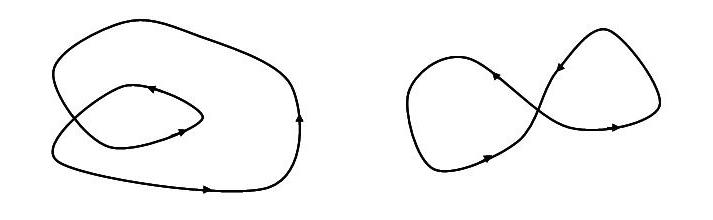
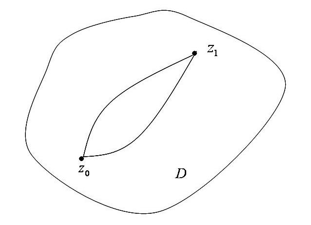
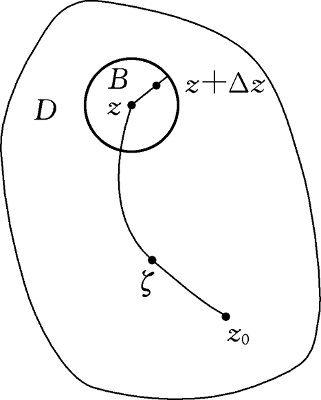
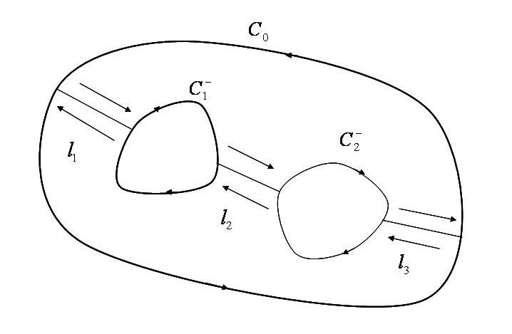

# 3.2 柯西-古萨定理及其推广

> 本节目标：理解并掌握柯西-古萨定理及其推论，理解单连通域内“积分与路径无关”的本质，掌握原函数、变上限函数与牛顿-莱布尼茨型公式，并能运用复合闭路定理处理多连通区域上有奇点时的积分。
> 重点：柯西-古萨定理（$\oint_C f(z)dz=0$）、推论 3.1/3.2、原函数与定理 3.3/3.4、复合闭路定理（定理 3.5）及应用。
> 难点：格林公式与柯西-黎曼方程在证明中的作用；多连通区域与复闭路；奇点与复合闭路选取。

## 3.2.1 柯西-古萨（Cauchy-Goursat）定理

假设函数 $f(z)=u+iv$ 在单连通域 $D$ 内处处解析，$f'(z)$ 在 $D$ 内连续，$u,v$ 对 $x,y$ 的偏导数在 $D$ 内连续。设 $z=x+iy$，$C$ 为 $D$ 内任一条简单闭曲线。由定理 3.1 有

$$
\int_C f(z)\,dz=\int_C u\,dx-v\,dy+i\int_C v\,dx+u\,dy .
$$

记 $G$ 为 $C$ 所围区域，由格林（Green）公式有

$$
\int_C u\,dx-v\,dy=\iint_G\left(-\frac{\partial v}{\partial x}-\frac{\partial u}{\partial y}\right)dxdy .
$$

由于 $f(z)=u+iv$ 在 $D$ 内解析，所以 $u,v$ 在 $D$ 内处处满足柯西-黎曼方程，即

$$
\frac{\partial u}{\partial x}=\frac{\partial v}{\partial y},\qquad \frac{\partial v}{\partial x}=-\frac{\partial u}{\partial y}.
$$

因此

$$
\int_C u\,dx-v\,dy=\int_C v\,dx-u\,dy=0,
$$

从而

$$
\oint_C f(z)\,dz=0 .
$$

**定理 3.2（柯西-古萨定理）** 若函数 $f(z)$ 是单连通域 $D$ 内的解析函数，则 $f(z)$ 沿 $D$ 内任一条闭曲线 $C$ 的积分为零，即

$$
\oint_C f(z)\,dz=0 .
$$

任意一条闭曲线都可以看成是由有限多条简单闭曲线衔接而成的。

## 3.2.2 柯西-古萨定理的推论

**推论 3.1** 设 $C$ 为 $z$ 平面上的一条闭曲线，它围成单连通域 $D$，若函数 $f(z)$ 在 $\bar D=D\cup C$ 上解析，则

$$
\oint_C f(z)\,dz=0 .
$$

**推论 3.2** 设函数 $f(z)$ 在单连通域 $D$ 解析，则 $f(z)$ 在 $D$ 内积分与路径无关。即积分 $\int_C f(z)dz$ 不依赖于连接起点 $z_0$ 与终点 $z_1$ 的曲线 $C$，而只与 $z_0$、$z_1$ 的位置有关。

**证明要点** 设 $C_1$ 和 $C_2$ 为 $D$ 内连接 $z_0$ 与 $z_1$ 的任意两条曲线。显然 $C_1$ 与 $C_2^-$ 连接成 $D$ 内一条闭曲线 $C$。由柯西-古萨定理

$$
\int_{C_1}f(z)\,dz+\int_{C_2^-}f(z)\,dz=\oint_C f(z)\,dz=0 .
$$

故

$$
\int_{C_1}f(z)\,dz=\int_{C_2}f(z)\,dz .
$$

## 3.2.3 原函数

函数 $f(z)$ 沿曲线 $C_1$ 和 $C_2$ 的积分又可以表示为

$$
\int_{C_1}f(z)\,dz=\int_{C_2}f(z)\,dz=\int_{z_0}^{z_1}f(z)\,dz .
$$

固定下限 $z_0$，让上限 $z_1$ 在区域 $D$ 内变动，并令 $z_1=z$，则确定了一个关于上限 $z$ 的单值函数

$$
F(z)=\int_{z_0}^{z}f(\zeta)\,d\zeta .
$$

并称 $F(z)$ 为定义在区域 $D$ 内的**积分上限函数**或**变上限函数**。

**定理 3.3** 若函数 $f(z)$ 在单连通域 $D$ 内解析，则函数 $F(z)$ 必在 $D$ 内解析，且 $F'(z)=f(z)$。

**证明要点** 若 $D$ 内任取一点 $z$，以 $z$ 为中心作一个含于 $D$ 内的小圆 $B$，在 $B$ 内取点 $z+\Delta z$（$\Delta z\neq0$）。由积分与路径无关，

$$
F(z+\Delta z)-F(z)=\int_{z_0}^{z+\Delta z}f(\zeta)\,d\zeta-\int_{z_0}^{z}f(\zeta)\,d\zeta=\int_{z}^{z+\Delta z}f(\zeta)\,d\zeta .
$$

而 $f(z)$ 是与积分变量 $\zeta$ 无关的值，故

$$
\int_{z}^{z+\Delta z}f(z)\,d\zeta=f(z)\int_{z}^{z+\Delta z}d\zeta=f(z)\Delta z .
$$

于是

$$
\frac{F(z+\Delta z)-F(z)}{\Delta z}-f(z)
=\frac{1}{\Delta z}\int_{z}^{z+\Delta z}\bigl(f(\zeta)-f(z)\bigr)d\zeta .
$$

又 $f(z)$ 在 $D$ 内解析，显然 $f(z)$ 在 $D$ 内连续。所以对于任给的 $\varepsilon>0$，必存在 $\delta>0$，使得当 $|\zeta-z|<\delta$（且 $\zeta$ 落在圆 $B$ 内），即当 $|\Delta z|<\delta$ 时，总有 $|f(\zeta)-f(z)|<\varepsilon$，从而

$$
\left|\frac{F(z+\Delta z)-F(z)}{\Delta z}-f(z)\right|
\le\frac{1}{|\Delta z|}\int_{z}^{z+\Delta z}|f(\zeta)-f(z)|\,d\zeta
\le\frac{1}{|\Delta z|}\varepsilon|\Delta z|=\varepsilon .
$$

故

$$
\lim_{\Delta z\to0}\frac{F(z+\Delta z)-F(z)}{\Delta z}=f(z),\qquad F'(z)=f(z) .
$$

**定义 3.2** 若在区域 $D$ 内，$\varphi(z)$ 的导数等于 $f(z)$，则称 $\varphi(z)$ 为 $f(z)$ 在 $D$ 内的**原函数**。变上限函数

$$
F(z)=\int_{z_0}^{z}f(\zeta)\,d\zeta
$$

为 $f(z)$ 的一个原函数。那么函数 $f(z)$ 的全体原函数可以表示为

$$
\varphi(z)=F(z)+C,
$$

其中 $C$ 为任意常数。

**定理 3.4** 若函数 $f(z)$ 在单连通域 $D$ 内处处解析，$\varphi(z)$ 为 $f(z)$ 的一个原函数，则

$$
\int_{z_0}^{z_1}f(z)\,dz=\varphi(z_1)-\varphi(z_0)=\varphi(z)\Big|_{z_0}^{z_1},
$$

其中 $z_0$、$z_1$ 为 $D$ 内的点。

**证明要点** $F(z)=\int_{z_0}^{z}f(\zeta)\,d\zeta$ 为 $f(z)$ 的一个原函数，故

$$
F(z)=\int_{z_0}^{z}f(\zeta)\,d\zeta=\varphi(z)+C .
$$

当 $z=z_0$ 时，根据柯西-古萨定理可知

$$
\int_{z_0}^{z_0}f(\zeta)\,d\zeta=\varphi(z_0)-\varphi(z_0)=0 .
$$

于是 $C=-\varphi(z_0)$，故

$$
\int_{z_0}^{z_1}f(z)\,dz=\varphi(z_1)-\varphi(z_0) .
$$

**例 3.4** 求积分 $\displaystyle\int_0^{\pi i/2}\sin 2z\,dz$ 的值。

**解** 因为 $\sin 2z$ 在复平面上解析，所以积分与路径无关。

$$
\int_0^{\pi i/2}\sin 2z\,dz
=-\frac12\cos 2z\Big|_0^{\pi i/2}
=-\frac12(\cos\pi i-\cos0)
=-\frac12\left(\frac{e^{-\pi}+e^{\pi}}{2}-1\right)
=\frac12-\frac{e^{-\pi}+e^{\pi}}{4}.
$$

**例 3.5** 求积分 $\displaystyle\int_0^i(z-1)e^{-z}\,dz$ 的值。

**解** 因为 $(z-1)e^{-z}$ 在复平面上解析，所以积分与路径无关。

$$
\int_0^i(z-1)e^{-z}\,dz=\int_0^i ze^{-z}\,dz-\int_0^i e^{-z}\,dz .
$$

上式右边第一个积分采用分部积分法，第二个积分可用凑微分法：

$$
\int_0^i(z-1)e^{-z}\,dz
=-ze^{-z}\Big|_0^i+\int_0^i e^{-z}\,dz-\int_0^i e^{-z}\,dz
=-ie^{-i}=-\sin1-i\cos1 .
$$

## 3.2.4 复合闭路定理

设有 $n+1$ 条简单闭曲线 $C_0,C_1,C_2,\dots,C_n$，其中 $C_1,C_2,\dots,C_n$ 互不相交也互不包含，并且都含于 $C_0$ 的内部。这 $n+1$ 条曲线围成了一个多连通区域 $D$，$D$ 的边界 $C$ 称作**复闭路**，它的正向为 $C_0$ 取逆时针方向，其它曲线都取顺时针方向。因此复闭路记作

$$
C=C_0+C_1^-+C_2^-+\cdots+C_n^- .
$$

**定理 3.5** 若 $f(z)$ 在复闭路 $C=C_0+C_1^-+C_2^-+\cdots+C_n^-$ 及其所围成的多连通区域内解析，则

$$
\oint_{C_0}f(z)\,dz=\oint_{C_1}f(z)\,dz+\oint_{C_2}f(z)\,dz+\cdots+\oint_{C_n}f(z)\,dz ,
$$

也就是

$$
\oint_C f(z)\,dz=0 .
$$

**证明要点** 做辅助线 $l_1,l_2,l_3$ 将 $C_0$、$C_1$ 及 $C_2$ 连接起来，从而把多连通区域 $D$ 划分为两个单连通区域 $D_1$ 及 $D_2$，并分别用 $\Gamma_1$ 及 $\Gamma_2$ 表示这两个区域的边界。由柯西-古萨定理

$$
\oint_{\Gamma_1}f(z)\,dz=0,\qquad \oint_{\Gamma_2}f(z)\,dz=0 .
$$

两式相加，辅助线上的积分正负相抵，得

$$
\oint_{C_0}f(z)\,dz-\oint_{C_1}f(z)\,dz-\oint_{C_2}f(z)\,dz=0,
$$

故

$$
\oint_{C_0}f(z)\,dz=\oint_{C_1}f(z)\,dz+\oint_{C_2}f(z)\,dz .
$$

**例 3.6** 计算 $\oint_C\dfrac{dz}{z^2+z}$ 的值，$C$ 为包含圆周 $|z|=1$ 在内的任何正向简单闭曲线。

**解** 显然 $z=0$ 和 $z=-1$ 是函数 $\dfrac{1}{z^2+z}$ 的两个奇点。由于 $C$ 为包含圆周 $|z|=1$ 在内的任何正向简单闭曲线，因此也包含了这两个奇点。在 $C$ 的内部作两个互不包含、互不相交的正向圆周 $C_1$ 和 $C_2$，其中 $C_1$ 的内部只包含奇点 $z=-1$，$C_2$ 的内部只包含奇点 $z=0$。函数 $\dfrac{1}{z^2+z}$ 在由 $C$、$C_1$、$C_2$ 所围成的多连通域内解析，由复合闭路定理及例 3.3，

$$
\begin{aligned}
\oint_C\frac{dz}{z^2+z}
&=\oint_{C_1}\frac{dz}{z^2+z}+\oint_{C_2}\frac{dz}{z^2+z}\\
&=\oint_{C_1}\left(\frac{1}{z}-\frac{1}{z+1}\right)dz
+\oint_{C_2}\left(\frac{1}{z}-\frac{1}{z+1}\right)dz\\
&=0-2\pi i+2\pi i-0=0 .
\end{aligned}
$$

## 常见错误与注意点

1. **单连通域是前提**：$f(z)$ 必须是单连通域 $D$ 内的解析函数，才能保证 $\oint_C f(z)dz=0$；若闭曲线内部有奇点，不能直接用柯西-古萨定理。
2. **方向**：复合闭路中外边界 $C_0$ 取逆时针，内边界 $C_i$ 取顺时针；符号不能写反。
3. **原函数存在性**：只有在单连通域内解析的函数才处处有原函数；在非单连通域内变上限函数可能不解析（多值）。
4. **牛顿-莱布尼茨公式**：$\int_{z_0}^{z_1}f(z)dz=\varphi(z_1)-\varphi(z_0)$ 的前提是 $f$ 在单连通域内解析且 $\varphi$ 是其一原函数。
5. **例 3.6**：要先把 $\dfrac{1}{z^2+z}$ 拆成 $\dfrac1z-\dfrac1{z+1}$，再分别对每个奇点使用例 3.3 的结论。

## 本节小结

- **柯西-古萨定理**：单连通域内解析函数沿闭曲线积分为零。
- **推论**：$f$ 在 $\bar D=D\cup C$ 上解析 $\Rightarrow\oint_C fdz=0$；单连通域内积分与路径无关。
- **原函数**：变上限函数 $F(z)=\int_{z_0}^z f(\zeta)d\zeta$ 解析且 $F'(z)=f(z)$；一般原函数 $\varphi(z)=F(z)+C$。
- **定理 3.4**：$\int_{z_0}^{z_1}fdz=\varphi(z_1)-\varphi(z_0)$。
- **复合闭路定理**：多连通区域上 $\oint_{C_0}fdz=\sum\oint_{C_i}fdz$（内边界取顺时针）。
