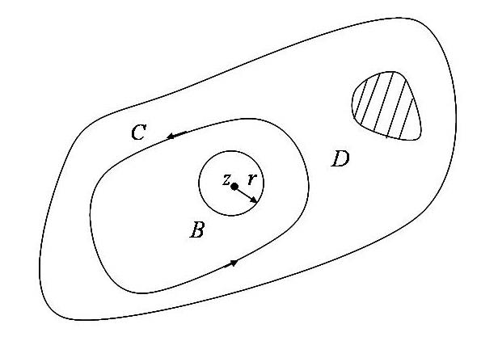

# 3.3 柯西积分公式及其推论

> 本节目标：掌握柯西积分公式及其证明思想，理解解析函数的高阶导数公式与解析函数无穷次可导的性质，能灵活运用柯西积分公式与高阶导数公式计算闭路积分；了解平均值定理。
> 重点：柯西积分公式、高阶导数公式、定理 3.8/3.9，及其在计算闭路积分中的应用（例 3.7–3.10）。
> 难点：柯西积分公式的证明（复合闭路、$r\to0$ 估计）；高阶导数公式中的“导数阶数”与“极点阶数”匹配；含多个奇点时的拆分。

## 3.3.1 柯西（Cauchy）积分公式

**定理 3.6** 若 $f(z)$ 是区域 $D$ 内的解析函数，$C$ 为 $D$ 内的简单闭曲线，$C$ 所围内部全含于 $D$ 内，$z$ 为 $C$ 内部任一点，则

$$
f(z)=\frac{1}{2\pi i}\oint_C\frac{f(\zeta)}{\zeta-z}\,d\zeta,
$$

其中积分沿曲线 $C$ 的正向。上式称为**柯西积分公式**。

**证明要点** 取定 $C$ 内部一点 $z$。因为 $f(z)$ 在 $D$ 内解析，所以 $f(z)$ 在点 $z$ 连续，即对任给的 $\forall\varepsilon>0$，必存在 $\delta>0$，当 $|\zeta-z|<\delta$ 时，有 $|f(\zeta)-f(z)|<\varepsilon$。

令

$$
F(\zeta)=\frac{f(\zeta)}{\zeta-z},
$$

则 $F(\zeta)$ 在 $D$ 内除去点 $z$ 外处处解析。现以 $z$ 为中心、$r$ 为半径作圆周

$$
B:|\zeta-z|=r,
$$

使圆 $B$ 的内部及边界全含于 $C$ 的内部。由复合闭路定理有

$$
\oint_C\frac{f(\zeta)}{\zeta-z}\,d\zeta=\oint_B\frac{f(\zeta)}{\zeta-z}\,d\zeta .
$$

令 $r\to0$，只需证明

$$
\oint_B\frac{f(\zeta)}{\zeta-z}\,d\zeta\to2\pi i f(z) .
$$

因为

$$
\oint_B\frac{1}{\zeta-z}\,d\zeta=2\pi i ,
$$

而 $f(z)$ 与 $\zeta$ 无关，于是

$$
\begin{aligned}
\left|\oint_B\frac{f(\zeta)}{\zeta-z}\,d\zeta-2\pi i f(z)\right|
&=\left|\oint_B\frac{f(\zeta)-f(z)}{\zeta-z}\,d\zeta\right|\\
&\le\oint_B\frac{|f(\zeta)-f(z)|}{|\zeta-z|}\,|d\zeta|
\le\oint_B\frac{\varepsilon}{r}\,ds
=\frac{\varepsilon}{r}\cdot2\pi r=2\pi\varepsilon .
\end{aligned}
$$

当 $r\to0$（从而 $\zeta\to z$）时，$2\pi\varepsilon\to0$，故柯西积分公式成立。

**平均值定理** 若函数 $f(z)$ 在曲线 $C$ 上恒为常数 $K$，$z_0$ 为 $C$ 内部任一点，则由柯西积分公式

$$
f(z)=\frac{1}{2\pi i}\oint_C\frac{f(\zeta)}{\zeta-z_0}\,d\zeta
=\frac{K}{2\pi i}\oint_C\frac{1}{\zeta-z_0}\,d\zeta
=\frac{K}{2\pi i}\cdot2\pi i=K,
$$

即 $f(z)$ 在曲线 $C$ 的内部也恒为常数 $K$。

若 $C$ 为圆周 $|\zeta-z_0|=R$，即

$$
\zeta=z_0+Re^{i\theta}\quad(0\le\theta\le2\pi),
$$

则 $d\zeta=iRe^{i\theta}d\theta$，从而

$$
f(z_0)=\frac{1}{2\pi i}\oint_C\frac{f(\zeta)}{\zeta-z_0}\,d\zeta
=\frac{1}{2\pi}\int_0^{2\pi}f(z_0+Re^{i\theta})\,d\theta .
$$

**解析函数在圆心 $z_0$ 处的值等于它在圆周上的平均值，这就是解析函数的平均值定理。**

若 $f(z)$ 在简单闭曲线 $C$ 所围成的区域内解析，且在 $C$ 上连续，则柯西积分公式仍然成立。柯西积分公式可以改写成

$$
\oint_C\frac{f(\zeta)}{\zeta-z}\,d\zeta=2\pi i f(z) .
$$

## 3.3.2 柯西积分公式的应用

**例 3.7** 计算积分 $\oint_{|z|=2}\dfrac{z^2+1}{z}\,dz$ 的值。

**解** 因为 $z^2+1$ 在 $|z|=2$ 内解析，

$$
\oint_{|z|=2}\frac{z^2+1}{z}\,dz
=2\pi i\cdot(z^2+1)\big|_{z=0}=2\pi i .
$$

**例 3.8** 计算积分 $\oint_C\dfrac{\sin\frac{\pi z}{6}}{z^2-1}\,dz$ 的值，其中 $C$ 为：

1. $|z-\frac32|=1$；
2. $|z+\frac32|=1$；
3. $|z|=3$。

**解** (1) 被积函数 $\dfrac{\sin\frac{\pi z}{6}}{z+1}$ 在 $|z-\frac32|=1$ 的内部解析，故

$$
\oint_C\frac{\sin\frac{\pi z}{6}}{z^2-1}\,dz
=\oint_C\frac{\sin\frac{\pi z}{6}}{z+1}\cdot\frac{1}{z-1}\,dz
=2\pi i\left(\frac{\sin\frac{\pi z}{6}}{z+1}\right)\Big|_{z=1}
=2\pi i\cdot\frac14=\frac{\pi i}{2}.
$$

(2) 被积函数 $\dfrac{\sin\frac{\pi z}{6}}{z-1}$ 在 $|z+\frac32|=1$ 的内部解析，故

$$
\oint_C\frac{\sin\frac{\pi z}{6}}{z^2-1}\,dz
=\oint_C\frac{\sin\frac{\pi z}{6}}{z-1}\cdot\frac{1}{z+1}\,dz
=2\pi i\left(\frac{\sin\frac{\pi z}{6}}{z-1}\right)\Big|_{z=-1}
=2\pi i\cdot\frac14=\frac{\pi i}{2}.
$$

(3) 被积函数在 $|z|=3$ 的内部有两个奇点 $z=1$ 和 $z=-1$。在 $C$ 的内部作两个互不包含、互不相交的正向圆周 $C_1$ 和 $C_2$，其中 $C_1$ 的内部只包含奇点 $z=1$，$C_2$ 的内部只包含奇点 $z=-1$。由复合闭路定理及柯西积分公式，

$$
\oint_C\frac{\sin\frac{\pi z}{6}}{z^2-1}\,dz
=\oint_{C_1}\frac{\sin\frac{\pi z}{6}}{z^2-1}\,dz+\oint_{C_2}\frac{\sin\frac{\pi z}{6}}{z^2-1}\,dz
=\frac{\pi i}{2}+\frac{\pi i}{2}=\pi i .
$$

## 3.3.3 高阶导数公式

**定理 3.7** 定义在区域 $D$ 的解析函数 $f(z)$ 有各阶导数，且有

$$
f^{(n)}(z)=\frac{n!}{2\pi i}\oint_C\frac{f(\zeta)}{(\zeta-z)^{n+1}}\,d\zeta\quad(n=1,2,\cdots),
$$

其中 $C$ 为区域 $D$ 内围绕 $z$ 的任何一条简单闭曲线，积分沿曲线 $C$ 的正向。

**定理 3.8** 若 $f(z)$ 为定义在区域 $D$ 内的解析函数，则在 $D$ 内其各阶导数都存在并且解析。换句话说，**解析函数的导数也是解析函数**。

**定理 3.9** 函数 $f(z)=u(x,y)+iv(x,y)$ 在区域 $D$ 内解析的充要条件是：

1. $u_x,u_y,v_x,v_y$ 在 $D$ 内连续；
2. $u(x,y),v(x,y)$ 在 $D$ 内满足柯西-黎曼方程

$$
\frac{\partial u}{\partial x}=\frac{\partial v}{\partial y},\qquad \frac{\partial u}{\partial y}=-\frac{\partial v}{\partial x}.
$$

**例 3.9** 求积分 $\oint_C\dfrac{e^z}{\left(z-\dfrac{\pi i}{2}\right)^2}\,dz$ 的值，其中 $C$ 为 $x^2+y^2=6y$。

**解** 被积函数在 $C$ 的内部有一个奇点 $z=\dfrac{\pi i}{2}$。由高阶导数公式（$n=1$），

$$
\oint_C\frac{e^z}{\left(z-\frac{\pi i}{2}\right)^2}\,dz
=2\pi i\left(e^z\right)'\Big|_{z=\pi i/2}
=2\pi i\,e^{\pi i/2}=2\pi i\cdot i=-2\pi .
$$

**例 3.10** 求积分 $\oint_C\dfrac{\cos\pi z}{z^3(z-1)^2}\,dz$ 的值，其中 $C$ 为 $|z|=2$。

**解** 被积函数在 $C$ 的内部有两个奇点 $z=0$ 和 $z=1$。作两条互不相交且互不包含的闭曲线 $C_1$ 和 $C_2$，分别包围奇点 $z=0$ 和 $z=1$，且两曲线所围区域全含于 $C$ 的内部。由复合闭路定理和高阶导数公式，

$$
\begin{aligned}
\oint_C\frac{\cos\pi z}{z^3(z-1)^2}\,dz
&=\oint_{C_1}\frac{\cos\pi z}{(z-1)^2}\cdot\frac{1}{z^3}\,dz
+\oint_{C_2}\frac{\cos\pi z}{z^3}\cdot\frac{1}{(z-1)^2}\,dz\\
&=\frac{2\pi i}{2!}\left(\frac{\cos\pi z}{(z-1)^2}\right)''\Big|_{z=0}
+2\pi i\left(\frac{\cos\pi z}{z^3}\right)'\Big|_{z=1}\\
&=(6-\pi^2)\pi i+6\pi i=(12-\pi^2)\pi i .
\end{aligned}
$$

> 说明：幻灯片把第二个导数项记作 $\left(\dfrac{\cos\pi z}{z^3}\right)'\Big|_{z=0}+2\pi i\cdot3$，此处按“$C_2$ 包围 $z=1$”的正确理解写为 $\left(\dfrac{\cos\pi z}{z^3}\right)'\Big|_{z=1}=3$，从而第二项为 $2\pi i\cdot3=6\pi i$。请以正确的求导与求值位置为准。

## 常见错误与注意点

1. **柯西积分公式**：只对“被积函数在 $C$ 内部解析、$z$ 在 $C$ 内部”的情形使用；要把积分写成 $\dfrac{f(\zeta)}{\zeta-z}$ 的形式，其中 $f(z)$ 在 $C$ 内部解析。
2. **高阶导数公式**：$f^{(n)}(z)=\dfrac{n!}{2\pi i}\oint\dfrac{f(\zeta)}{(\zeta-z)^{n+1}}d\zeta$，注意分母的阶数 $n+1$ 与 $n!$ 的对应；$n$ 是导数阶数。
3. **例 3.8/3.10**：圆内有多个孤立奇点时，要先“挖孔”作 $C_i$，再用复合闭路分解，最后对每个 $C_i$ 用柯西积分公式或高阶导数公式。
4. **证明中的 $2\pi\varepsilon$**：幻灯片最后一行写作 $2\pi i$ 应为 $2\pi\varepsilon$（随 $r\to0$ 而趋于 $0$），此处已按正确数学含义书写。
5. **$\sin\frac{\pi z}{6}$ 在 $z=\pm1$ 的值**：$\sin\frac{\pi}{6}=\frac12$，因此两个单圆积分都等于 $\frac{\pi i}{2}$。

## 本节小结

- **柯西积分公式**：$f(z)=\dfrac{1}{2\pi i}\oint_C\dfrac{f(\zeta)}{\zeta-z}d\zeta$，等价式 $\oint_C\dfrac{f(\zeta)}{\zeta-z}d\zeta=2\pi i f(z)$。
- **平均值定理**：解析函数在圆心处的值等于它在圆周上的平均值。
- **高阶导数公式**：$f^{(n)}(z)=\dfrac{n!}{2\pi i}\oint_C\dfrac{f(\zeta)}{(\zeta-z)^{n+1}}d\zeta$，由此得出解析函数无穷次可导且导数仍解析。
- **解析充要条件**：$u_x,u_y,v_x,v_y$ 连续且满足柯西-黎曼方程。
- **应用**：含孤立奇点的闭路积分可通过挖孔 + 柯西积分公式 / 高阶导数公式计算。
