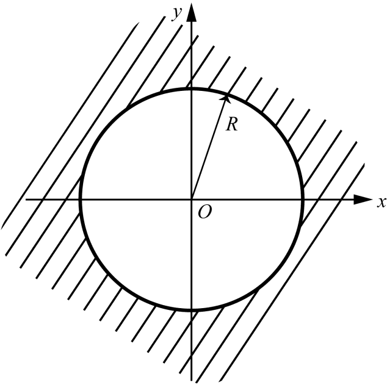

# 4.2 幂级数

> 本节目标：掌握幂级数的概念、收敛域（收敛半径、收敛圆）、收敛半径的比值法与根值法，以及幂级数在收敛圆内的解析性（逐项求导、逐项积分）。
> 重点：收敛半径的两种求法（定理 4.6、4.7）；幂级数在收敛圆内解析、可逐项求导与逐项积分的性质。
> 难点：收敛半径的意义、$|z|=R$ 边界上的敛散性、两个幂级数“运算后半径不小于 $\min\{R_1,R_2\}$”的理解；幂级数乘法（Cauchy 乘积）的收敛范围。

对应幻灯片：第 11–24 页。

## 4.2.1 幂级数的概念

**幂级数**是指形如

$$
\sum_{n=0}^{\infty} a_n(z-z_0)^n=a_0+a_1(z-z_0)+a_2(z-z_0)^2+\cdots+a_n(z-z_0)^n+\cdots
$$

的表达式，它的一般项是幂函数 $a_n(z-z_0)^n$，这里 $a_n\ (n=0,1,\cdots)$ 和 $z_0$ 是复常数，而 $z$ 为复变数。

给定 $z$ 的一个确定值 $z_1$，则

$$
\sum_{n=0}^{\infty}a_n(z_1-z_0)^n=a_0+a_1(z_1-z_0)+a_2(z_1-z_0)^2+\cdots
$$

为复数项级数。若该复数项级数收敛，则称幂级数在 $z_1$ 处收敛，$z_1$ 称为幂级数的一个收敛点；否则称为发散点。

若 $D$ 为幂级数所有收敛点的集合，则级数在 $D$ 上的和确定一个函数 $s(z)$：

$$
s(z)=\sum_{n=0}^{\infty}a_n z^n=a_0+a_1 z+a_2 z^2+\cdots+a_n z^n+\cdots,
$$

称 $s(z)$ 为幂级数的**和函数**。特别地，假定 $z_0=0$，幂级数成为

$$
\sum_{n=0}^{\infty}a_n z^n=a_0+a_1 z+a_2 z^2+\cdots+a_n z^n+\cdots .
$$

## 4.2.2 收敛半径和收敛圆

**定理 4.5** 如果幂级数 $\displaystyle\sum_{n=0}^{\infty}a_n z^n$ 在 $z=z_1(\neq 0)$ 处收敛，则对于满足 $|z|<|z_1|$ 的 $z$，级数必绝对收敛；如果在 $z=z_2$ 处级数发散，则对于 $|z|>|z_2|$ 的 $z$，级数必发散。

**证明要点** 由于 $\sum a_n z_1^n$ 级数收敛，有 $\lim_{n\to\infty}a_n z_1^n=0$，因而存在正数 $M$，使对所有的 $n$ 成立 $|a_n z_1^n|<M$。

如果 $|z|<|z_1|$，那么 $\left|\dfrac{z}{z_1}\right|=q<1$，而

$$
|a_n z^n|=|a_n z_1^n|\cdot\left|\frac{z}{z_1}\right|^n<Mq^n .
$$

由于 $\sum Mq^n$ 是公比小于 $1$ 的等比数列，故收敛，于是 $\sum|a_n z^n|$ 收敛，从而级数 $\sum a_n z^n$ 绝对收敛。

对“在 $z_2$ 发散”的情形，用反证法：若存在 $|z|>|z_2|$ 使级数收敛，则由已证部分会推出在 $z_2$ 处也收敛，矛盾。$\square$

幂级数 $\displaystyle\sum_{n=0}^{\infty}a_n z^n$ 的收敛情况只有三种：

1. 除 $z=0$ 外，级数处处发散；
2. 对于所有 $z$ 级数都收敛，级数在复平面内处处绝对收敛；
3. 存在一个正实数 $R$，使级数在 $|z|<R$ 中收敛，在 $|z|>R$ 中发散。

该正实数 $R$ 称为级数的**收敛半径**，以原点为中心、半径为 $R$ 的圆盘称为级数的**收敛圆**。对幂级数 $\displaystyle\sum_{n=0}^{\infty}a_n(z-z_0)^n$ 来说，它的收敛圆是以 $z_0$ 为中心的圆盘 $|z-z_0|<R$。

**例 4.2** 讨论幂级数

$$
\sum_{n=0}^{\infty}z^n=1+z+z^2+\cdots+z^n+\cdots
$$

的收敛范围与和函数。

**解** 级数的部分和为

$$
s_n(z)=
\begin{cases}
\dfrac{1-z^n}{1-z}, & z\neq 1,\\[4pt]
n, & z=1.
\end{cases}
$$

该级数的收敛半径为 $1$，收敛圆为 $|z|<1$，且级数在圆周 $|z|=1$ 上处处发散。于是

$$
\lim_{n\to\infty}s_n(z)=
\begin{cases}
\dfrac{1}{1-z}, & |z|<1,\\[4pt]
\text{发散}, & |z|\ge 1.
\end{cases}
$$

即和函数 $s(z)=\dfrac{1}{1-z}\ (|z|<1)$。

## 4.2.3 收敛半径的求法

**定理 4.6** 若 $\displaystyle\sum_{n=0}^{\infty}a_n z^n$ 的系数满足

$$
\lim_{n\to\infty}\left|\frac{a_{n+1}}{a_n}\right|=\rho ,
$$

则

1. 当 $0<\rho<+\infty$ 时，$R=\dfrac{1}{\rho}$；
2. 当 $\rho=0$ 时，$R=+\infty$（处处收敛）；
3. 当 $\rho=+\infty$ 时，$R=0$（仅有一个收敛点 $z=0$）。

**证明要点** 考虑正项级数

$$
\sum_{n=0}^{\infty}|a_n z^n|=|a_0|+|a_1 z|+\cdots+|a_n z^n|+\cdots,
$$

其相邻项之比

$$
\lim_{n\to\infty}\left|\frac{a_{n+1}z^{n+1}}{a_n z^n}\right|=\rho|z| .
$$

- 若 $0<\rho<+\infty$，由正项级数的比值判别法知，当 $\rho|z|<1$（即 $|z|<\frac{1}{\rho}$）时 $\sum|a_n z^n|$ 收敛，从而 $\sum a_n z^n$ 收敛；当 $\rho|z|>1$（即 $|z|>\frac{1}{\rho}$）时 $\lim\left|\frac{a_{n+1}z^{n+1}}{a_n z^n}\right|>1$，故当 $n$ 充分大时 $|a_{n+1}z^{n+1}|\ge|a_n z^n|$，所以当 $n\to\infty$ 时一般项 $a_n z^n$ 不能趋于零，级数发散。故收敛半径 $R=\frac{1}{\rho}$。
- 若 $\rho=0$，则 $\rho|z|<1$ 对任何 $z$ 成立，故对任何 $z$ 级数 $\sum|a_n z^n|$ 收敛（即处处绝对收敛），收敛半径 $R=+\infty$。
- 若 $\rho=+\infty$，对任意 $z\neq 0$，当 $n$ 充分大时必有 $|a_{n+1}z^{n+1}|\ge|a_n z^n|$，由此得 $\sum a_n z^n$ 发散，故收敛半径 $R=0$。$\square$

**定理 4.7** 若幂级数 $\displaystyle\sum_{n=0}^{\infty}a_n z^n$ 的系数满足

$$
\lim_{n\to\infty}\sqrt[n]{|a_n|}=\rho ,
$$

则

1. 当 $0<\rho<+\infty$ 时，$R=\dfrac{1}{\rho}$；
2. 当 $\rho=0$ 时，$R=+\infty$；
3. 当 $\rho=+\infty$ 时，$R=0$。

## 4.2.4 幂级数的运算及性质

**性质 4.1** 若幂级数 $\displaystyle\sum_{n=0}^{\infty}a_n z^n$ 和 $\displaystyle\sum_{n=0}^{\infty}b_n z^n$ 的收敛半径分别为 $R_1$ 和 $R_2$，则幂级数 $\displaystyle\sum_{n=0}^{\infty}(a_n\pm b_n)z^n$ 的收敛半径不小于

$$
R=\min\{R_1,R_2\},
$$

且在 $|z|<R$ 内有

$$
\sum_{n=0}^{\infty}a_n z^n\pm\sum_{n=0}^{\infty}b_n z^n=\sum_{n=0}^{\infty}(a_n\pm b_n)z^n .
$$

**性质 4.2** 若幂级数 $\displaystyle\sum_{n=0}^{\infty}a_n z^n$ 和 $\displaystyle\sum_{n=0}^{\infty}b_n z^n$ 的收敛半径分别为 $R_1$ 和 $R_2$，则幂级数（Cauchy 乘积）

$$
a_0b_0+(a_0b_1+a_1b_0)z+(a_0b_2+a_1b_1+a_2b_0)z^2+\cdots+\left(\sum_{i=0}^{n}a_i b_{n-i}\right)z^n+\cdots
$$

的收敛半径不小于 $R=\min\{R_1,R_2\}$，且在 $|z|<R$ 内有

$$
\left(\sum_{n=0}^{\infty}a_n z^n\right)\cdot\left(\sum_{n=0}^{\infty}b_n z^n\right)=\sum_{n=0}^{\infty}\left(\sum_{i=0}^{n}a_i b_{n-i}\right)z^n .
$$

**例 4.3** 设有幂级数 $\displaystyle\sum_{n=0}^{\infty}z^n$ 与 $\displaystyle\sum_{n=0}^{\infty}\frac{1}{1+a^n}z^n$（$0<a<1$），求

$$
\sum_{n=0}^{\infty}\left(1-\frac{1}{1+a^n}\right)z^n=\sum_{n=0}^{\infty}\frac{a^n}{1+a^n}z^n
$$

的收敛半径。

**解** $\displaystyle\sum_{n=0}^{\infty}z^n$ 和 $\displaystyle\sum_{n=0}^{\infty}\frac{1}{1+a^n}z^n$ 的收敛半径都为 $1$，而

$$
\sum_{n=0}^{\infty}\frac{a^n}{1+a^n}z^n
$$

的收敛半径为 $\dfrac{1}{a}\ (>1)$。但等式

$$
\sum_{n=0}^{\infty}z^n-\sum_{n=0}^{\infty}\frac{1}{1+a^n}z^n=\sum_{n=0}^{\infty}\left(1-\frac{1}{1+a^n}\right)z^n
$$

成立的范围仍为 $|z|<1$。当 $1\le|z|<\frac{1}{a}$ 时，等式左边的两个级数都不收敛，所以等式没有意义。

## 4.2.5 幂级数的解析性（逐项求导与逐项积分）

**定理 4.8** 设幂级数 $\displaystyle\sum_{n=0}^{\infty}a_n(z-z_0)^n$ 的收敛半径为 $R$，那么

1. 它的和函数 $\displaystyle f(z)=\sum_{n=0}^{\infty}a_n(z-z_0)^n$ 在收敛圆 $|z-z_0|<R$ 内是解析函数；
2. $f(z)$ 的导数可通过对其幂级数逐项求导得到，即

$$
f'(z)=\sum_{n=0}^{\infty}n a_n(z-z_0)^{n-1}\qquad (|z-z_0|<R);
$$

3. $f(z)$ 在 $|z-z_0|<R$ 内可以逐项积分，即

$$
\int_C f(z)\,\mathrm{d}z=\sum_{n=0}^{\infty}a_n\int_C(z-z_0)^n\,\mathrm{d}z,
$$

其中 $C$ 为 $|z-z_0|<R$ 内的曲线。

**例 4.4** 求出下列幂级数的和函数。

$$
(1)\ \sum_{n=1}^{\infty}(2^n-1)z^{n-1};\qquad
(2)\ \sum_{n=0}^{\infty}(n+1)z^n .
$$

**解**

**(1)** $\displaystyle\lim_{n\to\infty}\left|\frac{a_{n+1}}{a_n}\right|=\lim_{n\to\infty}\frac{|2^{n+1}-1|}{|2^n-1|}=2$，故收敛半径为 $R=\dfrac{1}{2}$。同样 $\sum_{n=1}^{\infty}2^n z^{n-1}$ 和 $\sum_{n=1}^{\infty}z^{n-1}$ 的收敛半径分别为 $R_1=\dfrac{1}{2}$ 和 $R_2=1$。

当 $|z|<\dfrac{1}{2}$ 时，

$$
\sum_{n=1}^{\infty}(2^n-1)z^{n-1}=\sum_{n=1}^{\infty}2^n z^{n-1}-\sum_{n=1}^{\infty}z^{n-1}
=2\sum_{n=1}^{\infty}(2z)^{n-1}-\sum_{n=1}^{\infty}z^{n-1}
$$

$$
=2\cdot\frac{1}{1-2z}-\frac{1}{1-z}=\frac{1}{(1-2z)(1-z)} .
$$

**(2)** $\displaystyle\lim_{n\to\infty}\left|\frac{a_{n+1}}{a_n}\right|=\lim_{n\to\infty}\frac{n+2}{n+1}=1$，故收敛半径为 $R=1$。

在 $|z|<1$ 内取一条连接 $0$ 和 $z$ 的简单曲线 $C$，由逐项积分性质，得

$$
\int_0^z\sum_{n=0}^{\infty}(n+1)w^n\,\mathrm{d}w=\sum_{n=0}^{\infty}\int_0^z(n+1)w^n\,\mathrm{d}w=\sum_{n=0}^{\infty}z^{n+1}=\frac{z}{1-z},\qquad |z|<1 .
$$

再对两边求导，得

$$
\sum_{n=0}^{\infty}(n+1)z^n=\left(\frac{z}{1-z}\right)'=\frac{1}{(1-z)^2},\qquad |z|<1 .
$$

## 常见错误与注意点

- 收敛半径只保证 $|z|<R$ 内收敛；边界 $|z|=R$ 上的点可能收敛、也可能发散，必须另行判断。
- 定理 4.6、4.7 中 $\rho$ 是**非负实数**，不要漏掉 $\rho=0$、$\rho=+\infty$ 两种极限情形。
- 幂级数做加减、乘法后，收敛半径只保证“不小于 $\min\{R_1,R_2\}$”，实际半径可能更大（见例 4.3），但在两个原级数都不收敛的区域内，用“和/差”表示的等式不成立。
- 逐项求导、逐项积分都在收敛圆内（开圆盘）进行，不能越过收敛圆周。

## 本节小结

- 幂级数 $\sum a_n(z-z_0)^n$ 的收敛域是以 $z_0$ 为中心的圆盘（或全平面、仅一点），边界敛散不定（§4.2.2）。
- 收敛半径可由比值法 $\rho=\lim|a_{n+1}/a_n|$ 或根值法 $\rho=\lim\sqrt[n]{|a_n|}$ 求得，$R=1/\rho$（定理 4.6、4.7）。
- 两幂级数之和、积在 $|z|<\min\{R_1,R_2\}$ 上成立，且和/积级数的半径不小于该值（性质 4.1、4.2）。
- 收敛圆内和函数解析，可逐项求导、逐项积分（定理 4.8），这是求幂级数和函数及泰勒展开的基础。
