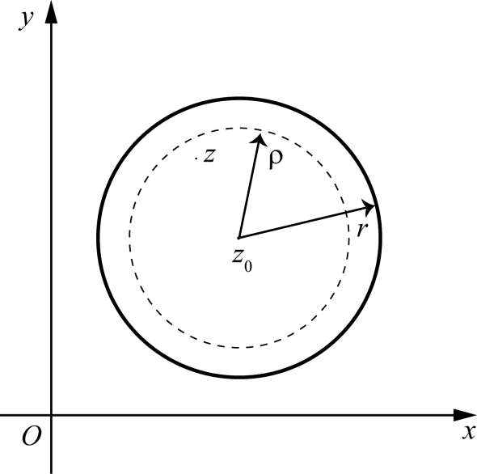

# 4.3 解析函数的泰勒展开

> 本节目标：理解解析函数在圆盘内可展开成幂级数（泰勒级数）这一基本定理，掌握展开式的唯一性、解析与有泰勒展式的等价关系、零点及其阶数判定，并牢记常用初等函数的泰勒展开式。
> 重点：泰勒定理（定理 4.9）及其思想；展开式唯一性；零点的阶数（$m$ 阶零点）；$\mathrm{e}^z$、$\cos z$、$\sin z$ 的展开。
> 难点：泰勒定理证明中柯西积分公式与几何级数展开、余项估计的思想；零点阶数与导数条件（性质 4.4）。

对应幻灯片：第 25–32 页。

## 4.3.1 泰勒定理

**定理 4.9** 设 $K$ 表示以 $z_0$ 为中心、半径为 $r$ 的一个圆，$f(z)$ 在 $K$ 内解析，则 $f(z)$ 可以在 $K$ 内展开成幂级数，即

$$
f(z)=\sum_{n=0}^{\infty}\frac{f^{(n)}(z_0)}{n!}(z-z_0)^n,\qquad z\in K .
$$

并称它为 $f(z)$ 在 $z_0$ 的泰勒（Taylor）展开式，上式右端的级数称为 $f(z)$ 的泰勒级数。

**证明要点**

1. 任意取定 $z\in K$，再取正数 $\rho$，使 $\rho<r$，且 $|z-z_0|<\rho$，即圆 $|\zeta-z_0|=\rho$ 在 $K$ 内。根据柯西积分公式，得

$$
f(z)=\frac{1}{2\pi\mathrm{i}}\oint_{|\zeta-z_0|=\rho}\frac{f(\zeta)}{\zeta-z}\,\mathrm{d}\zeta .
$$

2. 把 $\dfrac{1}{\zeta-z}$ 按 $|z-z_0|<|\zeta-z_0|$ 展开成几何级数：

$$
\frac{1}{\zeta-z}=\frac{1}{\zeta-z_0}\cdot\frac{1}{1-\dfrac{z-z_0}{\zeta-z_0}}=\frac{1}{\zeta-z_0}\sum_{n=0}^{\infty}\left(\frac{z-z_0}{\zeta-z_0}\right)^n .
$$

代入柯西公式，并与积分号交换，得

$$
f(z)=\sum_{n=0}^{N-1}\frac{f^{(n)}(z_0)}{n!}(z-z_0)^n+R_N(z),
$$

其中

$$
R_N(z)=\frac{1}{2\pi\mathrm{i}}\oint_{|\zeta-z_0|=\rho}\left(\sum_{n=N}^{\infty}\frac{f(\zeta)}{(\zeta-z_0)^{n+1}}(z-z_0)^n\right)\mathrm{d}\zeta .
$$

3. 对给定的 $z$，证明 $\lim_{N\to\infty}R_N(z)=0$。令

$$
q=\left|\frac{z-z_0}{\zeta-z_0}\right|=\frac{|z-z_0|}{\rho},
$$

则 $0\le q<1$。由于 $f(\zeta)$ 在 $|\zeta-z_0|=\rho$ 上连续，故有界，即存在 $M>0$，使 $|f(\zeta)|\le M$。于是

$$
|R_N(z)|\le\frac{1}{2\pi}\oint\left(\sum_{n=N}^{\infty}\frac{|f(\zeta)|}{|\zeta-z_0|}\cdot\left|\frac{z-z_0}{\zeta-z_0}\right|^n\right)|\mathrm{d}\zeta|
\le\frac{1}{2\pi}\sum_{n=N}^{\infty}\frac{M}{\rho}q^n\cdot 2\pi\rho=\frac{Mq^N}{1-q}\to 0 .
$$

4. 令 $N\to\infty$，得

$$
f(z)=\sum_{n=0}^{\infty}\frac{f^{(n)}(z_0)}{n!}(z-z_0)^n .
$$

由 $z$ 的任意性，故上式在 $K$ 内成立。$\square$

**展开式的唯一性** 假设另有展开式

$$
f(z)=\sum_{n=0}^{\infty}a_n(z-z_0)^n .
$$

逐项求 $k$ 阶导数，得

$$
f^{(k)}(z)=\sum_{n=k}^{\infty}n(n-1)\cdots(n-k+1)a_n(z-z_0)^{n-k}.
$$

令 $z=z_0$，即得 $f^{(k)}(z_0)=k!\,a_k$，所以有公式

$$
a_n=\frac{f^{(n)}(z_0)}{n!},\qquad n=0,1,2,\cdots .
$$

因此泰勒展开式是唯一的。

## 4.3.2 解析性与泰勒展式、零点

**定理 4.10** $f(z)$ 在 $z_0$ 处解析的充要条件是 $f(z)$ 在 $z_0$ 的邻域内有泰勒展式。

设 $f(z)$ 在 $z_0$ 处解析且 $f(z_0)=0$，则称 $z_0$ 为 $f(z)$ 的零点。

**性质 4.3** $z_0$ 为 $f(z)$ 的零点的充要条件是 $f(z)$ 在 $z_0$ 的邻域内可以表示为

$$
f(z)=(z-z_0)^m g(z),
$$

其中 $m$ 为某一正整数，$g(z)$ 在 $z_0$ 处解析且 $g(z_0)\neq 0$。此时称 $z_0$ 是 $f(z)$ 的 $m$ 阶零点。

**性质 4.4** $z_0$ 为 $f(z)$ 的 $m$ 阶零点的充要条件是

$$
f^{(n)}(z_0)=0\quad(n=0,1,\cdots,m-1),
$$

但有

$$
f^{(m)}(z_0)\neq 0 .
$$

**性质 4.5** 设 $z_0$ 为 $f(z)$ 的零点，且 $f(z)$ 在 $z_0$ 处任意阶导数都为零，即

$$
f^{(n)}(z_0)=0\quad(n=0,1,2,\cdots),
$$

则存在 $\delta>0$，使 $f(z)$ 在 $|z-z_0|<\delta$ 内恒等于零。

一个不恒为零的解析函数的零点是孤立的。

## 4.3.3 常用的初等函数的泰勒展开式

$$
\mathrm{e}^z=1+z+\cdots+\frac{z^n}{n!}+\cdots,\qquad |z|<\infty .
$$

$$
\cos z=\sum_{n=0}^{\infty}(-1)^n\frac{z^{2n}}{(2n)!}
=1-\frac{z^2}{2!}+\frac{z^4}{4!}-+\cdots+(-1)^n\frac{z^{2n}}{(2n)!}+\cdots,\qquad |z|<\infty .
$$

$$
\sin z=\sum_{n=0}^{\infty}(-1)^n\frac{z^{2n+1}}{(2n+1)!}
=z-\frac{z^3}{3!}+\frac{z^5}{5!}-+\cdots+(-1)^n\frac{z^{2n+1}}{(2n+1)!}+\cdots,\qquad |z|<\infty .
$$

## 4.3.4 例题

**例 4.5** 把函数 $\dfrac{1}{(1+z)^2}$ 展开成 $z-1$ 的幂级数。

**解**

$$
\frac{1}{(1+z)^2}=\frac{1}{4}\cdot\frac{1}{\left(1+\dfrac{z-1}{2}\right)^2}=\frac{1}{4}\cdot\frac{1}{(1+\zeta)^2}\qquad\left(\zeta=\frac{z-1}{2}\right).
$$

先写出

$$
\frac{1}{1+\zeta}=1-\zeta+\zeta^2-\cdots+(-1)^n\zeta^n+\cdots,\qquad|\zeta|<1 .
$$

两端求导得

$$
\frac{1}{(1+\zeta)^2}=1-2\zeta+3\zeta^2-4\zeta^3+\cdots+(-1)^{n-1}n\zeta^{n-1}+\cdots,\qquad|\zeta|<1 .
$$

代入 $\zeta=\dfrac{z-1}{2}$，得

$$
\frac{1}{(1+z)^2}=\frac{1}{4}\left(1-2\cdot\frac{z-1}{2}+3\left(\frac{z-1}{2}\right)^2-\cdots+(-1)^{n-1}n\left(\frac{z-1}{2}\right)^{n-1}+\cdots\right)
$$

$$
=\sum_{n=1}^{\infty}(-1)^{n-1}\frac{n}{2^{n+1}}(z-1)^{n-1},\qquad |z-1|<2 .
$$

## 常见错误与注意点

- 泰勒级数是“圆盘内”的展开；在边界圆周上不能保证展开式收敛或与函数相等。
- 展开式唯一：无论用什么方法得到的幂级数，其系数必为 $f^{(n)}(z_0)/n!$。
- $\cos z$ 展开式中只含偶次幂、$\sin z$ 只含奇次幂，且符号交替；展开式中不得混入错误幂次（如把 $\cos z$ 写成含 $z^5$ 项即错）。
- 零点阶数判定：$z_0$ 为 $m$ 阶零点 $\iff f(z_0)=\cdots=f^{(m-1)}(z_0)=0$ 且 $f^{(m)}(z_0)\neq 0$；注意“直到前一阶导数为零、阶导数不为零”。
- 不恒为零的解析函数的零点是孤立的，这一点在后续洛朗展开与孤立奇点中很重要。

## 本节小结

- 圆盘内解析 $\Rightarrow$ 可展开为收敛的泰勒级数（定理 4.9），且展开式唯一。
- 证明的核心是柯西积分公式 + 几何级数展开 + 余项趋于零（$q<1$）。
- 泰勒级数存在 $\iff$ 函数在该点解析（定理 4.10）。
- 零点的阶数可由 $f(z)=(z-z_0)^m g(z)$ 或导数条件（性质 4.3、4.4）判定。
- 常用的 $\mathrm{e}^z$、$\cos z$、$\sin z$ 展开式必须熟练记忆并会用于“换元”展开（见例 4.5）。
