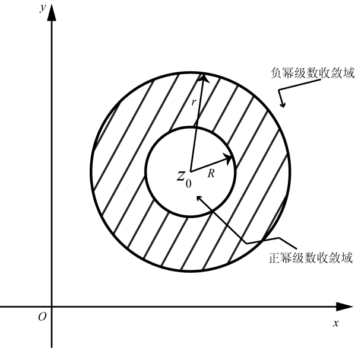
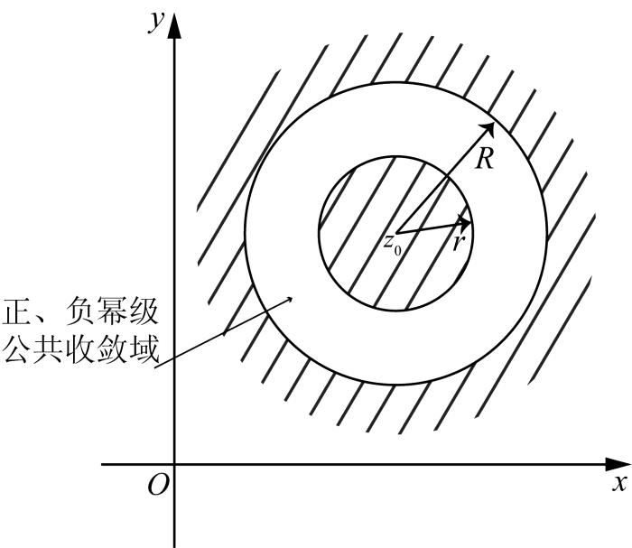
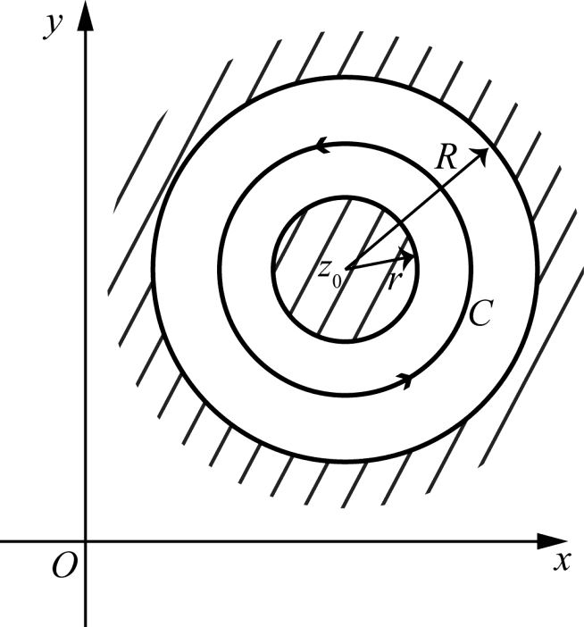

# 4.4 解析函数的洛朗展开

> 本节目标：理解洛朗级数（双向级数）及其收敛域——圆环，掌握洛朗定理（在圆环内解析可展开、且唯一），并会用部分分式法在给定圆环内求函数的洛朗展开。
> 重点：正幂级数与负幂级数的收敛域合成圆环；洛朗定理；给定圆环内的洛朗展开（例 4.6、4.7）。
> 难点：负幂级数的收敛域（$|z-z_0|>r$）理解；在不同圆环内展开式不同；洛朗展开唯一性指“在给定圆环内”唯一。

对应幻灯片：第 33–42 页。

## 4.4.1 洛朗级数（$z-z_0$ 的双向级数）

考虑级数

$$
\sum_{n=-\infty}^{\infty}a_n(z-z_0)^n=\cdots+a_{-n}(z-z_0)^{-n}+\cdots+a_{-1}(z-z_0)^{-1}+a_0+a_1(z-z_0)+\cdots+a_n(z-z_0)^n+\cdots,
$$

其中 $z_0$ 和 $a_n\ (n=0,\pm1,\pm2,\cdots)$ 为常数，$z$ 为变量。

把它分成两部分：

- $z-z_0$ 的**正幂级数**：

$$
\sum_{n=0}^{\infty}a_n(z-z_0)^n=a_0+a_1(z-z_0)+a_2(z-z_0)^2+\cdots+a_n(z-z_0)^n+\cdots;
$$

- $z-z_0$ 的**负幂级数**：

$$
\sum_{n=1}^{\infty}a_{-n}(z-z_0)^{-n}=a_{-1}(z-z_0)^{-1}+a_{-2}(z-z_0)^{-2}+\cdots+a_{-n}(z-z_0)^{-n}+\cdots .
$$

## 4.4.2 收敛域：圆环

如果在 $z=z_1$ 处，$z-z_0$ 的正幂级数和 $z-z_0$ 的负幂级数都收敛，就称 $z_1$ 为级数 $\displaystyle\sum_{n=-\infty}^{\infty}a_n(z-z_0)^n$ 的一个收敛点；不是收敛点的点就称为该级数的发散点。

$z-z_0$ 的正幂级数，它的收敛范围是圆盘 $|z-z_0|<R$，且 $|z-z_0|>R$ 时级数发散。

$z-z_0$ 的负幂级数

$$
\sum_{n=1}^{\infty}a_{-n}(z-z_0)^{-n}=\sum_{n=1}^{\infty}a_{-n}\zeta^n\qquad\left(\zeta=\frac{1}{z-z_0}\right),
$$

它的收敛半径为 $\rho$，则当 $|\zeta|<\rho$ 时收敛、$|\zeta|>\rho$ 时发散。记 $r=\dfrac{1}{\rho}$，于是负幂级数当 $|z-z_0|>r$ 时收敛，而 $|z-z_0|<r$ 时发散。

因此 $\displaystyle\sum_{n=-\infty}^{\infty}a_n(z-z_0)^n$ 的收敛集合取决于 $r$ 和 $R$。

1. 若 $r>R$，此时正幂级数和负幂级数没有公共的收敛范围，故级数在复平面上处处发散。
2. 若 $r<R$，此时正幂级数和负幂级数的公共收敛范围是圆环 $r<|z-z_0|<R$，所以级数在这个圆环内收敛，而在其外部发散。在其边界 $|z-z_0|=r$ 和 $|z-z_0|=R$ 上级数可能有收敛点，也可能有发散点。
3. 若 $r=R$，此时级数在 $|z-z_0|=R$ 以外的点处处发散，而在 $|z-z_0|=R$ 上的点无法直接断定其收敛性，要根据具体情况而定。

**定理 4.11** 级数 $\displaystyle\sum_{n=-\infty}^{\infty}a_n(z-z_0)^n$ 在其收敛圆环内的和函数是解析的，而且可以逐项积分和逐项求导数。

**例 4.6** 讨论级数

$$
\sum_{n=1}^{\infty}\frac{a^n}{z^n}+\sum_{n=0}^{\infty}\frac{z^n}{b^n}
$$

的收敛集，并求和函数，其中 $a$ 与 $b$ 为复常数。

**解** 分别讨论负幂级数和正幂级数。

**负幂级数** $\displaystyle\sum_{n=1}^{\infty}\left(\frac{a}{z}\right)^n$：当 $\left|\dfrac{a}{z}\right|<1$，即 $|z|>|a|$ 时收敛，且和函数为

$$
\frac{a}{z-a}.
$$

**正幂级数** $\displaystyle\sum_{n=0}^{\infty}\left(\frac{z}{b}\right)^n$：当 $\left|\dfrac{z}{b}\right|<1$，即 $|z|<|b|$ 时收敛，且和函数为

$$
\frac{b}{b-z}.
$$

（注：正幂级数收敛条件是 $|z|<|b|$，这样才能与负幂级数合成圆环 $|a|<|z|<|b|$。）

- 当 $|a|<|b|$ 时，原级数收敛且收敛圆环为 $|a|<|z|<|b|$，和函数为

$$
\frac{a}{z-a}+\frac{b}{b-z}=\frac{(a-b)z}{(a-z)(b-z)} .
$$

- 当 $|a|>|b|$ 时，负幂级数和正幂级数的收敛域没有公共点，故原级数发散。

在圆环 $|a|<|z|<|b|$ 内解析的函数 $\dfrac{(a-b)z}{(a-z)(b-z)}$ 可以展开为级数：

$$
\frac{(a-b)z}{(a-z)(b-z)}=\sum_{n=1}^{\infty}\frac{a^n}{z^n}+\sum_{n=0}^{\infty}\frac{z^n}{b^n}.
$$

## 4.4.3 洛朗定理

**定理 4.12** 设 $f(z)$ 在圆环 $r<|z-z_0|<R$ 内解析，那么

$$
f(z)=\sum_{n=-\infty}^{\infty}a_n(z-z_0)^n,\qquad r<|z-z_0|<R,
$$

其中

$$
a_n=\frac{1}{2\pi\mathrm{i}}\oint_C\frac{f(\zeta)}{(\zeta-z_0)^{n+1}}\,\mathrm{d}\zeta,\qquad n=0,\pm1,\pm2,\cdots,
$$

这里 $C$ 为圆环 $r<|z-z_0|<R$ 内任何一条绕 $z_0$ 的正向简单闭曲线，且 $f(z)$ 的表达式是唯一的。

$f(z)=\displaystyle\sum_{n=-\infty}^{\infty}a_n(z-z_0)^n\ (r<|z-z_0|<R)$ 称为函数 $f(z)$ 在以 $z_0$ 为中心的圆环 $r<|z-z_0|<R$ 内的**洛朗（Laurent）展开式**。它的右端称为在此圆环内的洛朗级数。

**洛朗展开式的唯一性** 所谓洛朗展开式的唯一性，是指函数在某一个给定的圆环的洛朗展开式是唯一的。

## 4.4.4 求洛朗展开的例题

**例 4.7** 求函数 $\displaystyle f(z)=\frac{1}{(z-1)(z-2)}$ 在下列圆环内的洛朗级数。

$$
(1)\ 0<|z|<1;\qquad
(2)\ 1<|z|<2;\qquad
(3)\ 2<|z|<+\infty;
$$

$$
(4)\ 0<|z-1|<1;\qquad
(5)\ 1<|z-1|<+\infty .
$$

**解** 将函数表示成部分分式，有

$$
f(z)=\frac{1}{1-z}-\frac{1}{2-z}.
$$

**(1)** 在 $0<|z|<1$ 内，由于 $|z|<1$，因此 $\left|\dfrac{z}{2}\right|<1$，故

$$
\frac{1}{1-z}=1+z+z^2+\cdots+z^n+\cdots,
$$

$$
\frac{1}{2-z}=\frac{1}{2}\cdot\frac{1}{1-z/2}=\frac{1}{2}\left(1+\frac{z}{2}+\frac{z^2}{4}+\cdots+\frac{z^n}{2^n}+\cdots\right).
$$

于是

$$
f(z)=\left(1+z+z^2+\cdots\right)-\frac{1}{2}\left(1+\frac{z}{2}+\frac{z^2}{4}+\cdots\right)=\sum_{n=0}^{\infty}\left(1-\frac{1}{2^{n+1}}\right)z^n
=\frac{1}{2}+\frac{3}{4}z+\frac{7}{8}z^2+\cdots .
$$

**(2)** 在 $1<|z|<2$ 内，$\left|\dfrac{1}{z}\right|<1$、$\left|\dfrac{z}{2}\right|<1$，故

$$
f(z)=\frac{1}{1-z}-\frac{1}{2-z}=-\frac{1}{z}\cdot\frac{1}{1-1/z}-\frac{1}{2}\cdot\frac{1}{1-z/2}
$$

$$
=-\frac{1}{z}\left(1+\frac{1}{z}+\frac{1}{z^2}+\cdots\right)-\frac{1}{2}\left(1+\frac{z}{2}+\frac{z^2}{4}+\cdots\right)
=-\sum_{n=1}^{\infty}\frac{1}{z^n}-\sum_{n=0}^{\infty}\frac{z^n}{2^{n+1}} .
$$

**(3)** 在 $2<|z|<+\infty$ 内，$\left|\dfrac{1}{z}\right|<1$、$\left|\dfrac{2}{z}\right|<1$，故

$$
f(z)=\frac{1}{1-z}-\frac{1}{2-z}=-\frac{1}{z}\cdot\frac{1}{1-1/z}+\frac{1}{z}\cdot\frac{1}{1-2/z}
$$

$$
=-\frac{1}{z}\left(1+\frac{1}{z}+\frac{1}{z^2}+\cdots\right)+\frac{1}{z}\left(1+\frac{2}{z}+\frac{4}{z^2}+\cdots\right)
=\frac{1}{z^2}+\frac{3}{z^3}+\frac{7}{z^4}+\cdots .
$$

**(4)** 在 $0<|z-1|<1$ 内，有

$$
f(z)=\frac{1}{z-2}-\frac{1}{z-1}=-\frac{1}{1-(z-1)}-\frac{1}{z-1}
=-\sum_{n=0}^{\infty}(z-1)^n-\frac{1}{z-1} .
$$

即

$$
f(z)=-\frac{1}{z-1}-1-(z-1)-(z-1)^2-\cdots-(z-1)^n-\cdots .
$$

**(5)** 在 $1<|z-1|<+\infty$ 内，$\left|\dfrac{1}{z-1}\right|<1$，故

$$
f(z)=\frac{1}{(z-1)-1}-\frac{1}{z-1}=\frac{1}{z-1}\cdot\frac{1}{1-1/(z-1)}-\frac{1}{z-1},
$$

$$
=\frac{1}{z-1}+\frac{1}{(z-1)^2}+\cdots+\frac{1}{(z-1)^n}+\cdots-\frac{1}{z-1}
=\frac{1}{(1-z)^2}+\frac{1}{(z-1)^3}+\cdots+\frac{1}{(z-1)^n}+\cdots .
$$

更简洁地，

$$
f(z)=\sum_{n=2}^{\infty}\frac{1}{(z-1)^n}\qquad(1<|z-1|<\infty).
$$

## 常见错误与注意点

- 洛朗展开的**收敛域是圆环** $r<|z-z_0|<R$，其中 $r$ 由负幂级数确定（$|z-z_0|>r$），$R$ 由正幂级数确定（$|z-z_0|<R$）。不要把负幂级数的收敛域也写成圆盘。
- 同一个函数在不同的圆环内，洛朗展开式不同；唯一性是指“在给定的某一个圆环内”唯一。
- 求洛朗展开一般先做部分分式，再在**指定的**圆环内选择合适的形式展开：缺项要补 $1$，且必须保证展开所用公比绝对值小于 $1$（例 4.7 中分别以 $\frac{z}{2}$、$\frac{1}{z}$、$\frac{2}{z}$、$\frac{1}{z-1}$ 等为公比）。
- 例 4.6 中正幂级数 $\sum(z/b)^n$ 的收敛条件是 $|z|<|b|$（幻灯片上“$|z|>|b|$”为笔误），它与负幂级数的 $|z|>|a|$ 合成圆环 $|a|<|z|<|b|$。

## 本节小结

- 洛朗级数是“正幂级数 + 负幂级数”的双向级数，其收敛域一般是圆环 $r<|z-z_0|<R$（还可能是空集、圆盘、圆内去心等退化情形）。
- 圆环内解析函数必有洛朗展开，且唯一（定理 4.12）；系数由围道积分给出，实际求法常用部分分式 + 几何级数。
- 圆环内和函数解析，可逐项求导、逐项积分（定理 4.11）。
- 洛朗展开是研究孤立奇点分类（§4.5）的直接工具：负幂项的多少决定奇点类型。
