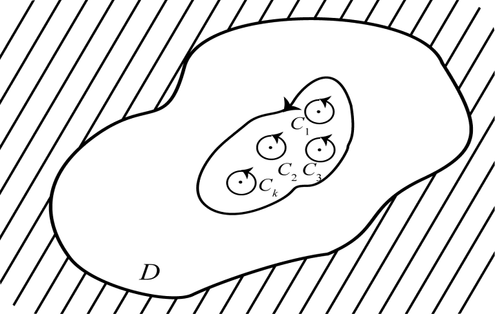

# 5.1 留数

> **本节目标**：理解留数的定义与几何意义，掌握留数定理及其证明，熟练运用极点的留数计算公式以及“商函数”留数公式，并了解无穷远点留数的概念与“全体奇点留数之和为零”的定理。
> **重点**：留数的定义、留数定理、极点留数的计算（$m$ 阶极点公式与 $P(z)/Q(z)$ 公式）。
> **难点**：无穷远点的留数概念，以及用洛朗展开求 $a_{-1}$ 的技巧。

## 5.1.1 留数的定义

设 $z_0$ 是 $f(z)$ 的**孤立奇点**。那么，对于解析圆环(去心邻域)内包含 $z_0$ 的正向简单闭曲线 $C$，积分

$$
\oint_C f(\zeta)\,\mathrm d\zeta
$$

只与 $f(z)$ 和 $z_0$ 有关，而与 $C$ 的选择无关；但该积分值不一定为零。

$f(z)$ 在 $z_0$ 的去心邻域内可展开成**洛朗级数**：

$$
f(z)=\sum_{n=-\infty}^{\infty}a_n\,(z-z_0)^{n},
$$

其中

$$
a_n=\frac{1}{2\pi\mathrm i}\oint_C\frac{f(\zeta)}{(\zeta-z_0)^{n+1}}\,\mathrm d\zeta,\qquad n=0,\pm1,\pm2,\ldots
$$

特别地，当 $n=-1$ 时，

$$
a_{-1}=\frac{1}{2\pi\mathrm i}\oint_C f(\zeta)\,\mathrm d\zeta .
$$

**定义 5.1（留数）** 把 $f(z)$ 在 $z_0$ 处的洛朗级数中 $(z-z_0)^{-1}$ 项的系数 $a_{-1}$ 称为 $f(z)$ 在孤立奇点 $z_0$ 处的**留数**，记作

$$
\operatorname{Res}\bigl[f(z),z_0\bigr]=a_{-1},
$$

即

$$
\operatorname{Res}\bigl[f(z),z_0\bigr]
=\frac{1}{2\pi\mathrm i}\oint_C f(z)\,\mathrm dz .
$$

**例 5.1** 求下列积分的值，其中 $C$ 为包含 $z=0$ 的简单正向闭曲线：

$$
(1)\ \oint_C z^{-3}\cos z\,\mathrm dz;\qquad
(2)\ \oint_C \mathrm e^{\frac{1}{z^{2}}}\,\mathrm dz .
$$

**解** （1）令 $f(z)=z^{-3}\cos z$，则 $z=0$ 为 $f(z)$ 的孤立奇点。由

$$
\cos z=1-\frac{z^{2}}{2!}+\frac{z^{4}}{4!}-\frac{z^{6}}{6!}+\cdots,\qquad |z|<\infty,
$$

得

$$
f(z)=\frac{1}{z^{3}}-\frac{1}{2}\cdot\frac{1}{z}+\frac{z}{4!}-\frac{z^{3}}{6!}+\cdots,\qquad 0<|z|<\infty .
$$

所以 $\operatorname{Res}\bigl[f(z),0\bigr]=-\dfrac12$，从而

$$
\oint_C z^{-3}\cos z\,\mathrm dz=-\pi\mathrm i .
$$

（2）令 $f(z)=\mathrm e^{1/z^{2}}$，则 $z=0$ 为 $f(z)$ 的孤立奇点。由

$$
\mathrm e^{\zeta}=1+\frac{\zeta}{1!}+\frac{\zeta^{2}}{2!}+\cdots+\frac{\zeta^{n}}{n!}+\cdots,\qquad |\zeta|<\infty,
$$

以 $\zeta=\dfrac{1}{z^{2}}$ 代入，得

$$
f(z)=1+\frac{1}{1!}\cdot\frac{1}{z^{2}}+\frac{1}{2!}\cdot\frac{1}{z^{4}}+\cdots+\frac{1}{n!}\cdot\frac{1}{z^{2n}}+\cdots,\qquad 0<|z|<\infty .
$$

此展开式中不含 $(z-0)^{-1}$ 项，所以 $\operatorname{Res}\bigl[f(z),0\bigr]=0$，于是

$$
\oint_C \mathrm e^{1/z^{2}}\,\mathrm dz=0 .
$$

## 5.1.2 留数定理

**定理 5.1（留数定理）** 设函数 $f(z)$ 在区域 $D$ 内除有有限个孤立奇点 $z_1,z_2,\ldots,z_n$ 外处处解析，$C$ 是 $D$ 内包围这些奇点的一条正向简单闭曲线，那么

$$
\oint_C f(z)\,\mathrm dz
=2\pi\mathrm i\sum_{k=1}^{n}\operatorname{Res}\bigl[f(z),z_k\bigr].
$$

**证明要点** 以 $z_k$ 为圆心，作完全含在 $C$ 内且互不相交的正向小圆

$$
C_k:\ |z-z_k|=\delta_k,\qquad (k=1,2,\ldots,n).
$$

由复合闭路上的柯西积分定理，有

$$
\oint_C f(z)\,\mathrm dz
=\oint_{C_1} f(z)\,\mathrm dz
+\oint_{C_2} f(z)\,\mathrm dz
+\cdots+\oint_{C_n} f(z)\,\mathrm dz .
$$

但由留数的定义，

$$
\oint_{C_k} f(z)\,\mathrm dz=2\pi\mathrm i\operatorname{Res}\bigl[f(z),z_k\bigr],\qquad k=1,2,\ldots,n,
$$

故

$$
\oint_C f(z)\,\mathrm dz
=2\pi\mathrm i\sum_{k=1}^{n}\operatorname{Res}\bigl[f(z),z_k\bigr].
$$

## 5.1.3 留数的计算方法

### (1) $m$ 阶极点的留数公式

**公式 5.1** 如果 $z_0$ 为 $f(z)$ 的 $m$ 阶极点，那么

$$
\operatorname{Res}\bigl[f(z),z_0\bigr]
=\frac{1}{(m-1)!}\lim_{z\to z_0}\frac{\mathrm d^{\,m-1}}{\mathrm d z^{\,m-1}}
\Bigl\{(z-z_0)^{m}\,f(z)\Bigr\}.
$$

**证明要点** 因为 $z_0$ 是 $f(z)$ 的 $m$ 阶极点，故在 $z_0$ 的邻域中有

$$
f(z)=\frac{g(z)}{(z-z_0)^{m}},
$$

其中 $g(z)$ 在 $z_0$ 处解析，且 $g(z_0)\neq0$。于是

$$
f(z)=\frac{1}{(z-z_0)^{m}}\sum_{n=0}^{\infty}\frac{g^{(n)}(z_0)}{n!}(z-z_0)^{n}
=\sum_{n=0}^{\infty}\frac{g^{(n)}(z_0)}{n!}(z-z_0)^{n-m}.
$$

其中 $(z-z_0)^{-1}$ 项的系数为（令 $n-m=-1$，即 $n=m-1$）

$$
\frac{g^{(m-1)}(z_0)}{(m-1)!}.
$$

又 $g(z)=(z-z_0)^{m}f(z)$，因而得到

$$
\frac{g^{(m-1)}(z_0)}{(m-1)!}
=\frac{1}{(m-1)!}\lim_{z\to z_0}\frac{\mathrm d^{\,m-1}}{\mathrm d z^{\,m-1}}
\Bigl\{(z-z_0)^{m}\,f(z)\Bigr\}.
$$

### (2) 一阶极点的留数公式

若 $z_0$ 是 $f(z)$ 的一阶极点，则由上式取 $m=1$，得

$$
\operatorname{Res}\bigl[f(z),z_0\bigr]
=\lim_{z\to z_0}(z-z_0)\,f(z).
$$

### (3) 商函数的留数公式

**公式 5.2** 设 $f(z)=\dfrac{P(z)}{Q(z)}$，$P(z),Q(z)$ 在 $z_0$ 处都是解析的。如果

$$
P(z_0)\neq0,\qquad Q(z_0)=0,\qquad Q'(z_0)\neq0,
$$

那么 $z_0$ 是 $f(z)$ 的一阶极点，因此有

$$
\operatorname{Res}\bigl[f(z),z_0\bigr]=\frac{P(z_0)}{Q'(z_0)}.
$$

**证明要点** 因 $Q(z_0)=0$ 且 $Q'(z_0)\neq0$，所以 $z_0$ 为 $Q(z)$ 的一级零点，从而

$$
\frac{1}{Q(z)}=\frac{1}{z-z_0}\,\varphi(z),
$$

其中 $\varphi(z)$ 在 $z_0$ 处解析且 $\varphi(z_0)\neq0$。于是

$$
f(z)=\frac{1}{z-z_0}\,\varphi(z)\,P(z),
$$

且 $\varphi(z_0)P(z_0)\neq0$，故 $z_0$ 为 $f(z)$ 的一阶极点。于是

$$
\begin{aligned}
\operatorname{Res}\bigl[f(z),z_0\bigr]
&=\lim_{z\to z_0}(z-z_0)f(z)
=\lim_{z\to z_0}(z-z_0)\frac{P(z)}{Q(z)}\\
&=\lim_{z\to z_0}\frac{P(z)}{\dfrac{Q(z)-Q(z_0)}{z-z_0}}
=\frac{P(z_0)}{Q'(z_0)}.
\end{aligned}
$$

**例 5.2** 求 $f(z)=\dfrac{5z-2}{z(z-1)^{2}}$ 分别在 $z=0$ 和 $z=1$ 的留数。

**解** $z=0$ 是 $f(z)$ 的一阶极点，故

$$
\operatorname{Res}\bigl[f(z),0\bigr]
=\lim_{z\to0}z\,f(z)
=\lim_{z\to0}\frac{5z-2}{(z-1)^{2}}=-2 .
$$

$z=1$ 是 $f(z)$ 的二阶极点，得

$$
\begin{aligned}
\operatorname{Res}\bigl[f(z),1\bigr]
&=\lim_{z\to1}\frac{\mathrm d}{\mathrm dz}\Bigl\{(z-1)^{2}f(z)\Bigr\}
=\lim_{z\to1}\frac{\mathrm d}{\mathrm dz}\left\{\frac{5z-2}{z}\right\}\\
&=\lim_{z\to1}\frac{5z-(5z-2)}{z^{2}}
=\lim_{z\to1}\frac{2}{z^{2}}=2 .
\end{aligned}
$$

**例 5.3** 计算 $f(z)=\dfrac{\mathrm e^{z}}{\sin z}$ 在 $z=0$ 处的留数。

**解** 取 $P(z)=\mathrm e^{z}$，$Q(z)=\sin z$，于是

$$
P(0)=1,\qquad Q(0)=0,\qquad Q'(0)=1,
$$

故

$$
\operatorname{Res}\bigl[f(z),0\bigr]=\frac{P(0)}{Q'(0)}=1 .
$$

**例 5.4** 计算 $f(z)=\dfrac{z-\sin z}{z^{6}}$ 在 $z=0$ 处的留数。

**解** 因为

$$
\begin{aligned}
\frac{z-\sin z}{z^{6}}
&=\frac{1}{z^{6}}\left[z-\left(z-\frac{1}{3!}z^{3}+\frac{1}{5!}z^{5}-\cdots\right)\right]\\
&=\frac{1}{3!}\cdot\frac{1}{z^{3}}-\frac{1}{5!}\cdot\frac{1}{z}+\cdots,
\end{aligned}
$$

所以

$$
\operatorname{Res}\left[\frac{z-\sin z}{z^{6}}\,,\,z_0\right]=a_{-1}=-\frac{1}{5!}.
$$

**例 5.5** 计算积分

$$
\oint_C \frac{z}{(z^{2}-1)^{2}(z^{2}+1)}\,\mathrm dz,
$$

这里 $C:\ |z-1|=\sqrt3$，取正向。

**解** 令

$$
f(z)=\frac{z}{(z^{2}-1)^{2}(z^{2}+1)},
$$

则 $z_1=\mathrm i$、$z_2=-\mathrm i$ 为 $f(z)$ 的两个一阶极点，$z_3=1$、$z_4=-1$ 为 $f(z)$ 的两个二阶极点。其中 $z_1,z_2,z_3$ 位于 $C$ 的内部（$z_4=-1$ 在 $C$ 外）。

由留数定理，

$$
\oint_C f(z)\,\mathrm dz=2\pi\mathrm i\sum_{k=1}^{3}\operatorname{Res}\bigl[f(z),z_k\bigr].
$$

计算得

$$
\operatorname{Res}\bigl[f(z),\mathrm i\bigr]
=\lim_{z\to\mathrm i}(z-\mathrm i)f(z)
=\lim_{z\to\mathrm i}\frac{z}{(z^{2}-1)^{2}(z+\mathrm i)}
=\frac{1}{8},
$$

$$
\operatorname{Res}\bigl[f(z),-\mathrm i\bigr]=\frac{1}{8},
$$

$$
\begin{aligned}
\operatorname{Res}\bigl[f(z),1\bigr]
&=\lim_{z\to1}\frac{\mathrm d}{\mathrm dz}\Bigl\{(z-1)^{2}f(z)\Bigr\}
=\lim_{z\to1}\frac{\mathrm d}{\mathrm dz}\left\{\frac{z}{(z+1)^{2}(z^{2}+1)}\right\}\\
&=\lim_{z\to1}\frac{-3z^{3}-z^{2}-z+1}{(z+1)^{3}(z^{2}+1)^{2}}
=-\frac{1}{8}.
\end{aligned}
$$

于是

$$
\oint_C f(z)\,\mathrm dz
=2\pi\mathrm i\left(\frac{1}{8}+\frac{1}{8}-\frac{1}{8}\right)
=\frac{\pi\mathrm i}{4}.
$$

> **注** 这里 $z_3=1$ 是二阶极点，其留数等于函数 $\dfrac{z}{(z+1)^{2}(z^{2}+1)}$ 在 $z=1$ 处的导数，结果为 $-\dfrac18$（容易误算为 $+\dfrac18$）。

## 5.1.4 在无穷远点的留数

设函数 $f(z)$ 在圆环域 $R<|z|<\infty$ 内解析，$C$ 为这圆环域内绕原点的任何一条简单闭曲线，那么称 $f(z)$ 沿 $C$ 的**负向**积分值

$$
\frac{1}{2\pi\mathrm i}\oint_{C^{-}}f(z)\,\mathrm dz
$$

为 $f(z)$ 在点 $\infty$ 的**留数**，记作

$$
\operatorname{Res}\bigl[f(z),\infty\bigr]
=\frac{1}{2\pi\mathrm i}\oint_{C^{-}}f(z)\,\mathrm dz
=\frac{1}{2\pi\mathrm i}\oint_{C}f(z)\,\mathrm dz
=-b_{-1},
$$

其中 $b_{-1}$ 是 $f(z)$ 在 $\infty$ 点的去心邻域 $R<|z|<\infty$ 内的洛朗展开式中 $z^{-1}$ 的系数。

**一句话结论**：$f(z)$ 在点 $\infty$ 的留数，等于它在 $\infty$ 点的去心邻域 $R<|z|<\infty$ 内的洛朗展开式中 $z^{-1}$ 的系数的相反数。

**定理 5.2** 如果函数 $f(z)$ 在扩充的复平面内只有有限个孤立奇点，那么 $f(z)$ 在所有奇点（包括 $\infty$ 点）的留数之和为零：

$$
\operatorname{Res}\bigl[f(z),\infty\bigr]+\sum_{k=1}^{n}\operatorname{Res}\bigl[f(z),z_k\bigr]=0 .
$$

**证明要点** 取 $r$ 充分大，使 $f(z)$ 的有限个孤立奇点 $z_k\ (k=1,2,\ldots,n)$ 都在 $|z|<r$ 中。由留数定理，得

$$
\oint_{|z|<r}f(z)\,\mathrm dz
=2\pi\mathrm i\sum_{k=1}^{n}\operatorname{Res}\bigl[f(z),z_k\bigr],
$$

其中积分取圆周的正向。由无穷远点留数的定义，

$$
\operatorname{Res}\bigl[f(z),\infty\bigr]=-\oint_{|z|<r}f(z)\,\mathrm dz,
$$

于是就有

$$
\operatorname{Res}\bigl[f(z),\infty\bigr]+\sum_{k=1}^{n}\operatorname{Res}\bigl[f(z),z_k\bigr]=0 .
$$

**例 5.6** 判定 $z=\infty$ 是函数 $f(z)=\dfrac{2z}{3+z^{2}}$ 的什么奇点？并求 $f(z)$ 在 $\infty$ 点的留数。

**解** 因为

$$
\lim_{z\to\infty}f(z)=0,
$$

所以 $\infty$ 点是**可去奇点**。$f(z)$ 在复平面内仅有 $\sqrt3\,\mathrm i$ 和 $-\sqrt3\,\mathrm i$ 两个一阶极点：

$$
\operatorname{Res}\bigl[f(z),\sqrt3\mathrm i\bigr]
=\lim_{z\to\sqrt3\mathrm i}\frac{2z}{z+\sqrt3\mathrm i}=1,
$$

$$
\operatorname{Res}\bigl[f(z),-\sqrt3\mathrm i\bigr]
=\lim_{z\to-\sqrt3\mathrm i}\frac{2z}{z-\sqrt3\mathrm i}=1.
$$

由定理 5.2，

$$
\begin{aligned}
\operatorname{Res}\bigl[f(z),\infty\bigr]
&=-\operatorname{Res}\bigl[f(z),\sqrt3\mathrm i\bigr]-\operatorname{Res}\bigl[f(z),-\sqrt3\mathrm i\bigr]\\
&=-1-1=-2 .
\end{aligned}
$$

## 常见错误与注意点

1. **留数只对孤立奇点有意义**。若 $z_0$ 不是孤立奇点（如本性奇点的聚点、非孤立奇点），不能直接写 $\operatorname{Res}[f,z_0]$。
2. **$m$ 阶极点公式别忘了 $(m-1)!$**。很多同学把分母写成 $m!$，导致结果差一个因子 $m$。
3. **二阶极点的留数需取导数**。例如例 5.5 中 $\operatorname{Res}[f,1]$ 是 $\dfrac{z}{(z+1)^2(z^2+1)}$ 在 $z=1$ 的导数，而不是该点的函数值；要先约去 $(z-1)^2$，再求导、再取极限。
4. **无穷远点留数的符号**。$\operatorname{Res}[f,\infty]$ 等于洛朗展开中 $z^{-1}$ 系数 $b_{-1}$ 的**相反数**，符号极易漏掉。
5. **用洛朗展开求 $a_{-1}$ 时，要抓住“被积函数展开式里 $(z-z_0)^{-1}$ 项的系数”**，不要与其它项混淆；例 5.1(2) 中 $e^{1/z^2}$ 的展开不含 $z^{-1}$ 项，故留数为 $0$。

## 本节小结

- 留数 $a_{-1}$ 刻画了 $f$ 在孤立奇点邻域内“$\frac{1}{z-z_0}$ 分量”的大小，且 $\operatorname{Res}[f,z_0]=\frac{1}{2\pi\mathrm i}\oint_C f\,\mathrm dz$。
- **留数定理** 把闭曲线上的复积分化为有限个孤立奇点留数之和：$\oint_C f\,\mathrm dz=2\pi\mathrm i\sum_k\operatorname{Res}[f,z_k]$。
- 计算留数的常用工具：
  - 洛朗展开（求 $a_{-1}$）；
  - $m$ 阶极点公式 $\dfrac{1}{(m-1)!}\lim\dfrac{\mathrm d^{m-1}}{\mathrm dz^{m-1}}\{(z-z_0)^mf(z)\}$；
  - 一阶极点 $\lim(z-z_0)f(z)$；
  - 商函数 $\dfrac{P(z)}{Q(z)}$ 的一阶极点 $\dfrac{P(z_0)}{Q'(z_0)}$。
- 无穷远点留数满足 $\operatorname{Res}[f,\infty]=-b_{-1}$，且当 $f$ 在扩充平面上只有有限个孤立奇点时，全体奇点（含 $\infty$）留数之和为 $0$。
