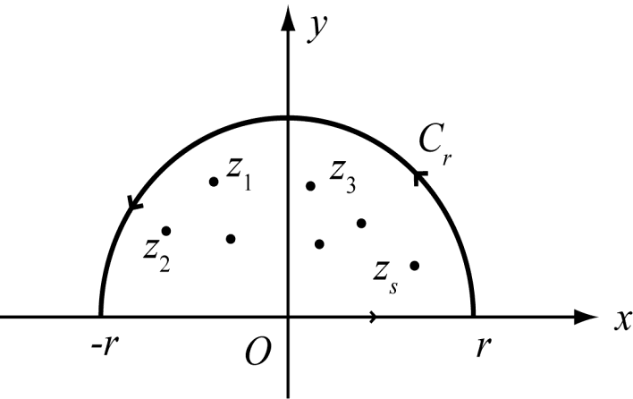
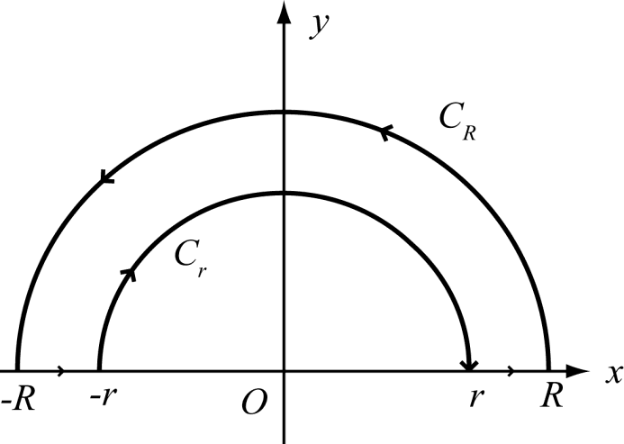
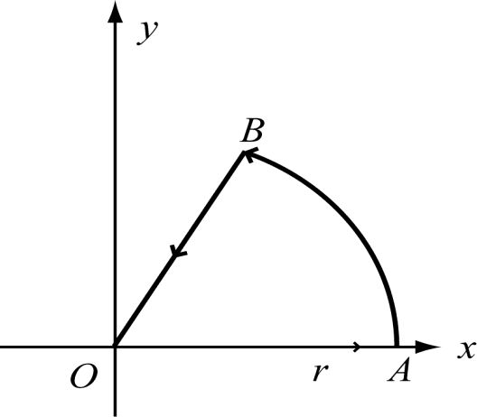

# 5.2 留数在积分计算上的应用

> **本节目标**：掌握用留数计算三类常见实定积分（有理函数无穷积分、含 $e^{\alpha \mathrm i x}$ 的积分、三角有理式 $R(\sin\theta,\cos\theta)$ 的周期积分）的方法，并能用留数计算若干特殊定积分（$\sin x/x$、Fresnel 积分）。
> **重点**：把实积分化为闭路复积分并利用留数定理求值；合理选取积分周线与验证“圆弧上积分趋于零”。
> **难点**：积分周线的构造（半圆、带小圆弧的“避点周线”、扇形周线），以及 Jordan 不等式用来估计圆弧积分。

## 5.2.1 形如 $\displaystyle\int_{-\infty}^{+\infty}R(x)\,\mathrm dx$ 的积分

设

$$
R(x)=\frac{P(x)}{Q(x)}
$$

为有理函数，其中

$$
P(x)=x^{m}+a_1x^{m-1}+\cdots+a_m,\qquad
Q(x)=x^{n}+b_1x^{n-1}+\cdots+b_n,
$$

$P(x),Q(x)$ 为两个既约实多项式，$Q(x)$ 没有实零点，且 $n-m\ge2$。

把 $x$ 换成复变量 $z$，得到复函数

$$
R(z)=\frac{P(z)}{Q(z)},
$$

则除 $Q(z)$ 的有限个零点外，$R(z)$ 处处解析。

![图5.2 半圆周线：$[-r,r]$ 与上半圆弧 $C_r$](images/fig-p18-fe74c3b0.png)

取积分周线 $C_r$ 为 $x$ 轴上 $[-r,r]$ 与上半平面圆弧 $C_r$ 所围成的闭路。由留数定理，得

$$
\int_{-r}^{r}R(x)\,\mathrm dx+\int_{C_r}R(z)\,\mathrm dz
=2\pi\mathrm i\sum_{k=1}^{s}\operatorname{Res}\bigl[R(z),z_k\bigr],
$$

其中 $z_k\ (k=1,2,\ldots,s)$ 是 $R(z)$ 在上半平面内的孤立奇点。当 $r$ 充分大时，右端的值与 $r$ 无关。

为求 $r\to\infty$ 时的极限，先估计圆弧上的积分。由

$$
|R(z)|=\frac{1}{|z|^{n-m}}\cdot\frac{\bigl|1+a_1z^{-1}+\cdots+a_mz^{-m}\bigr|}{\bigl|1+b_1z^{-1}+\cdots+b_nz^{-n}\bigr|}
\le\frac{1}{|z|^{n-m}}\cdot\frac{1+|a_1z^{-1}|+\cdots+|a_mz^{-m}|}{1-|b_1z^{-1}|-\cdots-|b_nz^{-n}|},
$$

故存在常数 $M$，当 $|z|$ 充分大时，有

$$
|R(z)|\le\frac{M}{|z|^{n-m}}\le\frac{M}{|z|^{2}}.
$$

令 $z=r\mathrm e^{\mathrm i\theta}$，于是

$$
\Bigl|\int_{C_r}R(z)\,\mathrm dz\Bigr|
\le\int_{0}^{\pi}\frac{M}{r^{2}}\,r\,\mathrm d\theta
=\frac{\pi M}{r}\to0\quad(r\to\infty).
$$

令 $r\to\infty$，得

$$
\boxed{\displaystyle\int_{-\infty}^{+\infty}R(x)\,\mathrm dx
=2\pi\mathrm i\sum_{k=1}^{s}\operatorname{Res}\bigl[R(z),z_k\bigr]},
$$

其中 $z_k$ 为 $R(z)$ 在上半平面内的孤立奇点。

**例 5.7** 计算积分

$$
\int_{-\infty}^{+\infty}\frac{x^{2}-x+2}{x^{4}+10x^{2}+9}\,\mathrm dx .
$$

**解** 记

$$
R(z)=\frac{z^{2}-z+2}{z^{4}+10z^{2}+9},
$$

则 $R(z)$ 在上半平面内有 $2$ 个一阶极点 $z_1=\mathrm i$ 和 $z_2=3\mathrm i$。

$$
\operatorname{Res}\bigl[R(z),\mathrm i\bigr]=\frac{-1-\mathrm i}{16},\qquad
\operatorname{Res}\bigl[R(z),3\mathrm i\bigr]=\frac{3-7\mathrm i}{48}.
$$

于是

$$
\begin{aligned}
\int_{-\infty}^{+\infty}\frac{x^{2}-x+2}{x^{4}+10x^{2}+9}\,\mathrm dx
&=2\pi\mathrm i\left(\frac{-1-\mathrm i}{16}+\frac{3-7\mathrm i}{48}\right)\\
&=2\pi\mathrm i\cdot\frac{-5\mathrm i}{24}
=\frac{5}{12}\pi .
\end{aligned}
$$

**例 5.8** 计算积分

$$
\int_{0}^{+\infty}\frac{x^{2}}{1+x^{4}}\,\mathrm dx .
$$

**解** $R(x)=\dfrac{x^{2}}{1+x^{4}}$ 为偶函数，故

$$
\int_{0}^{+\infty}\frac{x^{2}}{1+x^{4}}\,\mathrm dx
=\frac12\int_{-\infty}^{+\infty}\frac{x^{2}}{1+x^{4}}\,\mathrm dx .
$$

$R(z)=\dfrac{z^{2}}{1+z^{4}}$ 的分母高于分子两次，在实轴上无奇点，在上半平面上有两个一阶极点

$$
z_1=\frac{\sqrt2}{2}(1+\mathrm i),\qquad
z_2=\frac{\sqrt2}{2}(-1+\mathrm i),
$$

其留数为

$$
\operatorname{Res}\bigl[R(z),z_1\bigr]=\frac{1-\mathrm i}{4\sqrt2},\qquad
\operatorname{Res}\bigl[R(z),z_2\bigr]=-\frac{1+\mathrm i}{4\sqrt2}.
$$

（幻灯片把这两个留数分别写成 $\dfrac{1+\mathrm i}{4\sqrt2\,\mathrm i}$ 与 $\dfrac{1-\mathrm i}{4\sqrt2\,\mathrm i}$，二者等价。）于是

$$
\begin{aligned}
\int_{-\infty}^{+\infty}\frac{x^{2}}{1+x^{4}}\,\mathrm dx
&=2\pi\mathrm i\left(-\frac{2\mathrm i}{4\sqrt2}\right)
=\frac{\pi}{\sqrt2}=\frac{\sqrt2}{2}\pi,\\
\int_{0}^{+\infty}\frac{x^{2}}{1+x^{4}}\,\mathrm dx
&=\frac12\cdot\frac{\sqrt2}{2}\pi=\frac{\sqrt2}{4}\pi .
\end{aligned}
$$

## 5.2.2 形如 $\displaystyle\int_{-\infty}^{+\infty}R(x)\mathrm e^{\alpha\mathrm i x}\,\mathrm dx\ (\alpha>0)$ 的积分

设 $R(x)$ 是实轴上连续的有理函数，而分母的次数 $n$ 至少要比分子的次数 $m$ 高一次（$n-m\ge1$），且 $R$ 在实轴上无奇点。取积分曲线 $C_r$（$[-r,r]$ 与上半圆弧 $C_r$），当 $r$ 充分大时，使 $z_k\ (k=1,2,\ldots,s)$ 全落在曲线 $C_r$ 与 $[-r,r]$ 所围成的区域内。

由留数定理，

$$
\int_{-r}^{r}R(x)\mathrm e^{\alpha\mathrm i x}\,\mathrm dx
+\int_{C_r}R(z)\mathrm e^{\alpha\mathrm i z}\,\mathrm dz
=2\pi\mathrm i\sum_{k=1}^{s}\operatorname{Res}\bigl[R(z)\mathrm e^{\alpha\mathrm i z},z_k\bigr].
$$

又 $n-m\ge1$，故当 $|z|$ 充分大时，有

$$
|R(z)|\le\frac{M}{|z|}.
$$

因此

$$
\begin{aligned}
\Bigl|\int_{C_r}R(z)\mathrm e^{\alpha\mathrm i z}\,\mathrm dz\Bigr|
&=\Bigl|\int_{0}^{\pi}R(r\mathrm e^{\mathrm i\theta})\mathrm e^{\alpha\mathrm i r\mathrm e^{\mathrm i\theta}}\cdot \mathrm i r\mathrm e^{\mathrm i\theta}\,\mathrm d\theta\Bigr|\\
&\le M\int_{0}^{\pi}\mathrm e^{-\alpha r\sin\theta}\,\mathrm d\theta
=2M\int_{0}^{\pi/2}\mathrm e^{-\alpha r\sin\theta}\,\mathrm d\theta .
\end{aligned}
$$

当 $0\le\theta\le\dfrac{\pi}{2}$ 时，$\sin\theta\ge\dfrac{2\theta}{\pi}$（Jordan 不等式），所以有

$$
\Bigl|\int_{C_r}R(z)\mathrm e^{\alpha\mathrm i z}\,\mathrm dz\Bigr|
\le2M\int_{0}^{\pi/2}\mathrm e^{-\alpha r\frac{2\theta}{\pi}}\,\mathrm d\theta
=\frac{M\pi}{\alpha r}\,\bigl(1-\mathrm e^{-\alpha r}\bigr)\to0\quad(r\to\infty).
$$

> **注** 幻灯片此处写为 $\dfrac{M\pi}{2r}(1-\mathrm e^{-\alpha r})$，漏掉了分母中的 $\alpha$。按 Jordan 不等式严格计算应为 $\dfrac{M\pi}{\alpha r}(1-\mathrm e^{-\alpha r})$。

当 $r\to\infty$ 时，$\displaystyle\int_{C_r}R(z)\mathrm e^{\alpha\mathrm i z}\,\mathrm dz\to0$，得

$$
\boxed{\displaystyle\int_{-\infty}^{+\infty}R(x)\mathrm e^{\alpha\mathrm i x}\,\mathrm dx
=2\pi\mathrm i\sum_{k=1}^{s}\operatorname{Res}\bigl[R(z)\mathrm e^{\alpha\mathrm i z},z_k\bigr]} .
$$

分开实、虚部，即

$$
\int_{-\infty}^{+\infty}R(x)\cos\alpha x\,\mathrm dx
+\mathrm i\int_{-\infty}^{+\infty}R(x)\sin\alpha x\,\mathrm dx
=2\pi\mathrm i\sum_{k=1}^{s}\operatorname{Res}\bigl[R(z)\mathrm e^{\alpha\mathrm i z},z_k\bigr].
$$

**例 5.9** 求积分

$$
\int_{-\infty}^{+\infty}\frac{\cos x}{x^{2}+4x+5}\,\mathrm dx .
$$

**解** 设

$$
R(z)=\frac{1}{z^{2}+4z+5},
$$

则 $R(z)$ 的分母高于分子二次，实轴上无奇点，上半平面只有一个一阶极点 $z=-2+\mathrm i$。于是

$$
\begin{aligned}
\int_{-\infty}^{+\infty}\frac{\mathrm e^{\mathrm i x}}{x^{2}+4x+5}\,\mathrm dx
&=2\pi\mathrm i\operatorname{Res}\bigl[R(z)\mathrm e^{\mathrm i z},-2+\mathrm i\bigr]\\
&=2\pi\mathrm i\lim_{z\to-2+\mathrm i}\bigl(z-(-2+\mathrm i)\bigr)R(z)\mathrm e^{\mathrm i z}\\
&=2\pi\mathrm i\lim_{z\to-2+\mathrm i}\frac{\mathrm e^{\mathrm i z}}{z+2+\mathrm i}
=2\pi\mathrm i\cdot\frac{\mathrm e^{-1-2\mathrm i}}{2\mathrm i}
=\pi\mathrm e^{-1-2\mathrm i},\\
\int_{-\infty}^{+\infty}\frac{\cos x}{x^{2}+4x+5}\,\mathrm dx
&=\operatorname{Re}\bigl[\pi\mathrm e^{-1-2\mathrm i}\bigr]
=\pi\mathrm e^{-1}\cos 2 .
\end{aligned}
$$

## 5.2.3 特殊定积分举例 I：$\displaystyle\int_{0}^{+\infty}\frac{\sin x}{x}\,\mathrm dx$

**例 5.10** 计算积分 $\displaystyle\int_{0}^{+\infty}\frac{\sin x}{x}\,\mathrm dx$ 的值。

**解** 取函数

$$
f(z)=\frac{\mathrm e^{\mathrm i z}}{z},
$$

并取周线如图：上半平面大圆弧 $C_R$、小圆弧 $C_r$（绕过原点 $z=0$）及实轴上的两段之和。

在此周线中 $f(z)$ 是解析的（$z=0$ 已被小圆弧绕开），由柯西积分定理，得

$$
\int_{-R}^{-r}\frac{\mathrm e^{\mathrm i x}}{x}\,\mathrm dx
+\int_{C_r}\frac{\mathrm e^{\mathrm i z}}{z}\,\mathrm dz
+\int_{r}^{R}\frac{\mathrm e^{\mathrm i x}}{x}\,\mathrm dx
+\int_{C_R}\frac{\mathrm e^{\mathrm i z}}{z}\,\mathrm dz
=0 .
$$

令 $x=-t$，则有

$$
\int_{-R}^{-r}\frac{\mathrm e^{\mathrm i x}}{x}\,\mathrm dx
=-\int_{r}^{R}\frac{\mathrm e^{-\mathrm i t}}{t}\,\mathrm dt
=-\int_{r}^{R}\frac{\mathrm e^{-\mathrm i x}}{x}\,\mathrm dx .
$$

所以

$$
\int_{r}^{R}\frac{\mathrm e^{\mathrm i x}-\mathrm e^{-\mathrm i x}}{x}\,\mathrm dx
+\int_{C_R}\frac{\mathrm e^{\mathrm i z}}{z}\,\mathrm dz
+\int_{C_r}\frac{\mathrm e^{\mathrm i z}}{z}\,\mathrm dz
=0,
$$

即

$$
2\mathrm i\int_{r}^{R}\frac{\sin x}{x}\,\mathrm dx
+\int_{C_R}\frac{\mathrm e^{\mathrm i z}}{z}\,\mathrm dz
+\int_{C_r}\frac{\mathrm e^{\mathrm i z}}{z}\,\mathrm dz
=0 .
$$

由于

$$
\Bigl|\int_{C_R}\frac{\mathrm e^{\mathrm i z}}{z}\,\mathrm dz\Bigr|
\le\int_{0}^{\pi}\frac{\bigl|\mathrm e^{\mathrm i R\mathrm e^{\mathrm i\theta}}\bigr|}{R}\cdot R\,\mathrm d\theta
=\int_{0}^{\pi}\mathrm e^{-R\sin\theta}\,\mathrm d\theta
=2\int_{0}^{\pi/2}\mathrm e^{-R\sin\theta}\,\mathrm d\theta
\le\frac{\pi}{R}\bigl(1-\mathrm e^{-R}\bigr),
$$

故

$$
\lim_{R\to\infty}\int_{C_R}\frac{\mathrm e^{\mathrm i z}}{z}\,\mathrm dz=0 .
$$

又因为

$$
\frac{\mathrm e^{\mathrm i z}}{z}
=\frac{1}{z}+\mathrm i-\frac{z}{2!}+\cdots+\mathrm i^{n}\frac{z^{n-1}}{n!}+\cdots
=\frac{1}{z}+\varphi(z),
$$

其中 $\varphi(z)$ 在 $z=0$ 处解析，且 $\varphi(0)=\mathrm i$。因此当 $|z|$ 充分小时，可设 $|\varphi(z)|\le2$。由于

$$
\int_{C_r}\frac{\mathrm e^{\mathrm i z}}{z}\,\mathrm dz
=\int_{C_r}\frac{\mathrm dz}{z}+\int_{C_r}\varphi(z)\,\mathrm dz,
$$

而

$$
\int_{C_r}\frac{\mathrm dz}{z}
=\int_{\pi}^{0}\frac{\mathrm i r\mathrm e^{\mathrm i\theta}}{r\mathrm e^{\mathrm i\theta}}\,\mathrm d\theta
=-\mathrm i\pi,
\qquad
\Bigl|\int_{C_r}\varphi(z)\,\mathrm dz\Bigr|\le2\pi r\to0,
$$

故有

$$
\lim_{r\to0}\int_{C_r}\frac{\mathrm e^{\mathrm i z}}{z}\,\mathrm dz=-\pi\mathrm i .
$$

令 $R\to\infty$，$r\to0$，则有

$$
2\mathrm i\int_{0}^{+\infty}\frac{\sin x}{x}\,\mathrm dx-\pi\mathrm i=0,
$$

即

$$
\boxed{\displaystyle\int_{0}^{+\infty}\frac{\sin x}{x}\,\mathrm dx=\frac{\pi}{2}} .
$$

## 5.2.4 形如 $\displaystyle\int_{0}^{2\pi}R(\sin\theta,\cos\theta)\,\mathrm d\theta$ 的积分

设 $R(x,y)$ 是两个变量 $x,y$ 的有理函数。令 $z=\mathrm e^{\mathrm i\theta}$，那么

$$
\sin\theta=\frac{1}{2\mathrm i}\bigl(\mathrm e^{\mathrm i\theta}-\mathrm e^{-\mathrm i\theta}\bigr)
=\frac{1}{2\mathrm i}\Bigl(z-\frac{1}{z}\Bigr)
=\frac{z^{2}-1}{2\mathrm i z},
$$

$$
\cos\theta=\frac{1}{2}\bigl(\mathrm e^{\mathrm i\theta}+\mathrm e^{-\mathrm i\theta}\bigr)
=\frac{1}{2}\Bigl(z+\frac{1}{z}\Bigr)
=\frac{z^{2}+1}{2z},
$$

$$
\mathrm d\theta=\frac{\mathrm dz}{\mathrm i z}.
$$

从而原积分化为沿正向单位圆周的积分：

$$
\int_{0}^{2\pi}R(\cos\theta,\sin\theta)\,\mathrm d\theta
=\oint_{|z|=1}R\left(\frac{z^{2}+1}{2z},\frac{z^{2}-1}{2\mathrm i z}\right)\frac{\mathrm dz}{\mathrm i z}
=\oint_{|z|=1}f(z)\,\mathrm dz,
$$

其中 $f(z)$ 为 $z$ 的有理函数，且在单位圆周 $|z|=1$ 上分母不为零。

**例 5.11** 计算积分

$$
\int_{0}^{2\pi}\cos^{4}4\theta\,\mathrm d\theta .
$$

**解** 令 $z=\mathrm e^{\mathrm i\theta}\ (0\le\theta\le2\pi)$，则

$$
\cos4\theta=\frac{z^{4}+z^{-4}}{2}=\frac{z^{8}+1}{2z^{4}},
$$

所以

$$
\begin{aligned}
\int_{0}^{2\pi}\cos^{4}4\theta\,\mathrm d\theta
&=\oint_{|z|=1}\left(\frac{z^{4}+z^{-4}}{2}\right)^{4}\frac{\mathrm dz}{\mathrm i z}
=\frac{1}{\mathrm i}\oint_{|z|=1}\frac{(z^{8}+1)^{4}}{16z^{17}}\,\mathrm dz .
\end{aligned}
$$

在 $0<|z|<1$ 内，被积函数的洛朗展开式为

$$
\frac{(z^{8}+1)^{4}}{16z^{17}}
=\frac{1}{16}z^{-17}+\frac{1}{4}z^{-9}+\frac{3}{8}z^{-1}+\cdots.
$$

所以 $operatorname{Res}\Bigl[\dfrac{(z^{8}+1)^{4}}{16z^{17}},0\Bigr]=\dfrac38$，从而

$$
\int_{0}^{2\pi}\cos^{4}4\theta\,\mathrm d\theta
=\frac{1}{\mathrm i}\left\{2\pi\mathrm i\cdot\frac{3}{8}\right\}
=\frac{3}{4}\pi .
$$

## 5.2.5 特殊定积分举例 II：Fresnel 积分

由于留数是与闭曲线上的复积分相联系的，因此利用留数来计算定积分需要有两个主要的转化过程：

1. 将定积分的**被积函数**转化为复函数；
2. 将定积分的**积分区间**转化为复积分的闭路曲线。

下面用此方法计算积分

$$
\int_{0}^{\infty}\cos x^{2}\,\mathrm dx,\qquad
\int_{0}^{\infty}\sin x^{2}\,\mathrm dx .
$$

应取函数 $f(z)=\mathrm e^{\mathrm i z^{2}}$，取积分周线如图（扇形周线：$OA$ 为实轴上 $0\le x\le r$，$AB$ 为以原点为圆心、半径 $r$、辐角从 $0$ 到 $\pi/4$ 的圆弧，$BO$ 为辐角 $\pi/4$ 的径向线段）。

因为 $f(z)$ 在闭周线内解析，由柯西积分定理，有

$$
\int_{OA}\mathrm e^{\mathrm i z^{2}}\,\mathrm dz
+\int_{AB}\mathrm e^{\mathrm i z^{2}}\,\mathrm dz
+\int_{BO}\mathrm e^{\mathrm i z^{2}}\,\mathrm dz
=0 .
$$

（1）当 $z$ 在 $OA$ 上时，$z=x,\ 0\le x\le r$，

$$
\int_{OA}\mathrm e^{\mathrm i z^{2}}\,\mathrm dz=\int_{0}^{r}\mathrm e^{\mathrm i x^{2}}\,\mathrm dx .
$$

（2）当 $z$ 在 $AB$ 上时，$z=r\mathrm e^{\mathrm i\theta},\ 0\le\theta\le\dfrac{\pi}{4}$，此时 $\sin2\theta\ge\dfrac{4}{\pi}\theta$，所以

$$
\bigl|\mathrm e^{\mathrm i z^{2}}\bigr|=\mathrm e^{-r^{2}\sin2\theta}\le\mathrm e^{-\frac{4}{\pi}r^{2}\theta},
$$

$$
\Bigl|\int_{AB}\mathrm e^{\mathrm i z^{2}}\,\mathrm dz\Bigr|
\le\int_{0}^{\pi/4}\mathrm e^{-\frac{4}{\pi}r^{2}\theta}\cdot r\,\mathrm d\theta
=\frac{\pi}{4r}\bigl(1-\mathrm e^{-r^{2}}\bigr)\to0\quad(r\to\infty).
$$

（3）当 $z$ 在 $BO$ 上时，$z=x\mathrm e^{\mathrm i\pi/4},\ 0\le x\le r$，则

$$
\int_{BO}\mathrm e^{\mathrm i z^{2}}\,\mathrm dz
=\int_{r}^{0}\mathrm e^{\mathrm i x^{2}\mathrm e^{\mathrm i\pi/2}}\cdot\mathrm e^{\mathrm i\pi/4}\,\mathrm dx
=-\mathrm e^{\mathrm i\pi/4}\int_{0}^{r}\mathrm e^{-x^{2}}\,\mathrm dx .
$$

令 $r\to\infty$，得

$$
\int_{0}^{\infty}\mathrm e^{\mathrm i x^{2}}\,\mathrm dx
+0-\mathrm e^{\mathrm i\pi/4}\int_{0}^{\infty}\mathrm e^{-x^{2}}\,\mathrm dx=0 .
$$

又

$$
\int_{0}^{\infty}\mathrm e^{-x^{2}}\,\mathrm dx=\frac{\sqrt\pi}{2},
$$

因此

$$
\int_{0}^{\infty}\mathrm e^{\mathrm i x^{2}}\,\mathrm dx
=\mathrm e^{\mathrm i\pi/4}\int_{0}^{\infty}\mathrm e^{-x^{2}}\,\mathrm dx
=\mathrm e^{\mathrm i\pi/4}\cdot\frac{\sqrt\pi}{2}.
$$

上式两边分别取实部和虚部，即得

$$
\boxed{\displaystyle\int_{0}^{\infty}\cos x^{2}\,\mathrm dx
=\int_{0}^{\infty}\sin x^{2}\,\mathrm dx
=\frac{1}{2}\sqrt{\frac{\pi}{2}}
=\frac{\sqrt{2\pi}}{4}} .
$$

> **注** 幻灯片最后一行为 $\dfrac12\cdot\dfrac{\sqrt\pi}{2}=\dfrac{\sqrt\pi}{4}$，这是笔误。正确的应为 $\dfrac12\sqrt{\dfrac{\pi}{2}}=\dfrac{\sqrt{2\pi}}{4}$。

## 常见错误与注意点

1. **用 $\int R(x)\mathrm dx$ 公式前必须验证 $n-m\ge2$**。若只差一次，圆弧积分不一定为 $0$，此时要用含 $\mathrm e^{\alpha\mathrm i x}$ 的公式（$n-m\ge1$）。
2. **只取上半平面的极点**。留数求和只对 $C_r$ 内部的极点进行；实轴上的极点需另作处理（一般用小圆弧绕过）。
3. **Jordan 不等式**：当 $0\le\theta\le\pi/2$ 时 $\sin\theta\ge\dfrac{2\theta}{\pi}$。估算 $\displaystyle\int_0^{\pi/2}\mathrm e^{-\alpha r\sin\theta}\mathrm d\theta$ 时，结果应为 $\dfrac{M\pi}{\alpha r}(1-\mathrm e^{-\alpha r})$；幻灯片写成了 $\dfrac{M\pi}{2r}(1-\mathrm e^{-\alpha r})$，漏掉了 $\alpha$。
4. **含 $\mathrm e^{\alpha\mathrm i x}$ 的积分常分开实、虚部求值**。例如例 5.9 中，$\int\cos x/(x^2+4x+5)\mathrm dx=\operatorname{Re}[\pi\mathrm e^{-1-2\mathrm i}]=\pi\mathrm e^{-1}\cos2$，不要忘记取实部。
5. **例 5.8 的乘子“$2\pi\mathrm i$”不要写成“$2\pi$”**。幻灯片写 $2\pi\left(\cdots\right)$ 是漏了 $\mathrm i$；严格应为 $2\pi\mathrm i\sum\operatorname{Res}$。另外，幻灯片把这两个留数写成 $\dfrac{1+\mathrm i}{4\sqrt2\,\mathrm i}$ 与 $\dfrac{1-\mathrm i}{4\sqrt2\,\mathrm i}$，等价于 $\dfrac{1-\mathrm i}{4\sqrt2}$ 与 $-\dfrac{1+\mathrm i}{4\sqrt2}$。
6. **$\sin x/x$ 的周线要避开原点**。因为 $z=0$ 是被积函数的可去奇点，周线必须用小圆弧绕开，且小圆弧积分 $\to-\pi\mathrm i$。$\lim_{r\to0}\int_{C_r}\mathrm e^{\mathrm i z}/z\,\mathrm dz=-\pi\mathrm i$ 的符号很关键。
7. **Fresnel 积分结果**：$\int_0^\infty\cos x^2\mathrm dx=\int_0^\infty\sin x^2\mathrm dx=\dfrac12\sqrt{\dfrac{\pi}{2}}=\dfrac{\sqrt{2\pi}}{4}$。不要把幻灯片中的 $\dfrac{\sqrt\pi}{4}$ 当成正确结果。

## 本节小结

- **无理函数无穷积分** $\int_{-\infty}^{\infty}R(x)\mathrm dx$（$n-m\ge2$，$Q$ 无实零点）：取上半平面半圆，$R$ 在圆弧上为 $O(|z|^{-2})$，故圆弧积分趋于 $0$，结果是 $2\pi\mathrm i\sum\operatorname{Res}[R,z_k]$（$z_k$ 在上半平面）。
- **含 $\mathrm e^{\alpha\mathrm i x}$ 的积分**（$\alpha>0$，$n-m\ge1$）：用 Jordan 不等式估计圆弧，结果 $2\pi\mathrm i\sum\operatorname{Res}[R\mathrm e^{\alpha\mathrm i z},z_k]$；$\alpha i$ 的实部为负保证上半圆弧被“压”到 $0$。
- **三角有理式周期积分** $\int_0^{2\pi}R(\sin\theta,\cos\theta)\mathrm d\theta$：令 $z=\mathrm e^{\mathrm i\theta}$，化为单位圆周上的复积分 $\oint_{|z|=1}f(z)\mathrm dz$。
- **特殊定积分**：$\int_0^\infty\frac{\sin x}{x}\mathrm dx=\frac{\pi}{2}$；$\int_0^\infty\cos x^2\mathrm dx=\int_0^\infty\sin x^2\mathrm dx=\frac{\sqrt{2\pi}}{4}$。
- 核心思想：**用留数定理计算实定积分时，关键是“选对周线、让非待求部分趋于零、把待求部分与留数联系起来”**。
